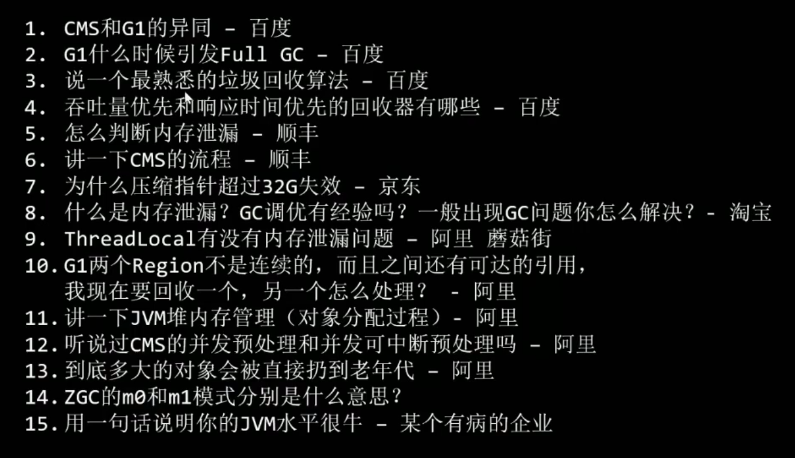
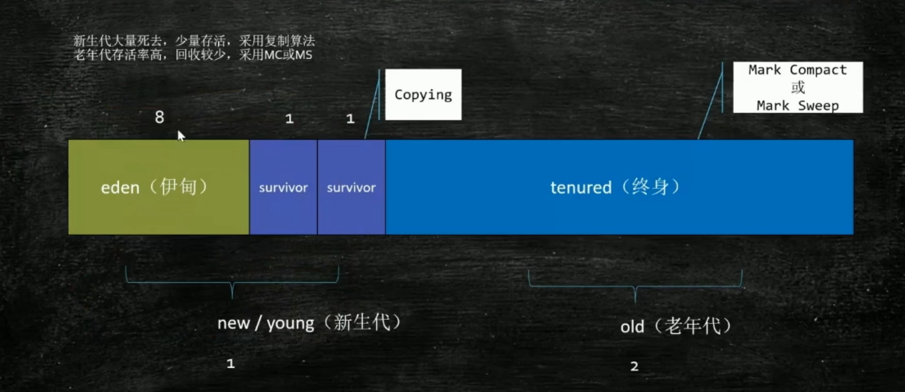
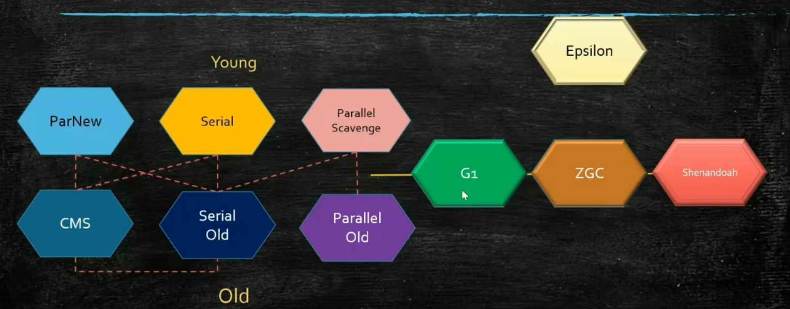
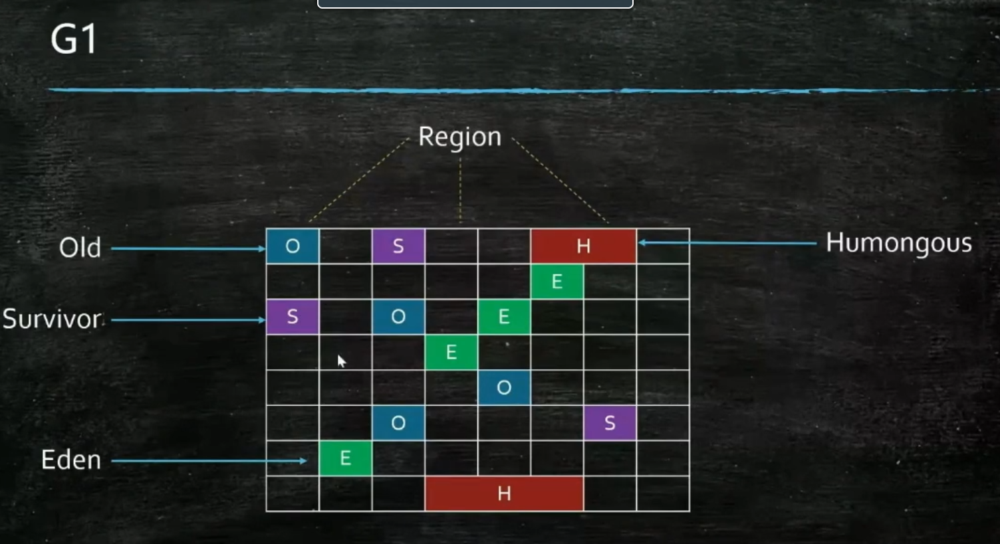
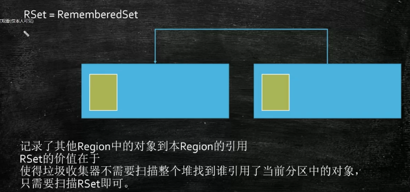
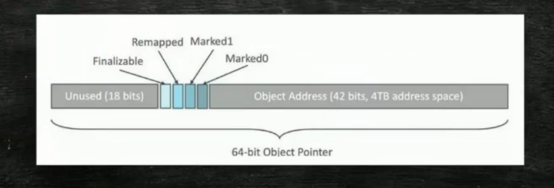

[[TOC]]

ZGC

https://mp.weixin.qq.com/s/5trCK-KlwikKO-R6kaTEAg

G1

https://www.jianshu.com/p/369f06cbc6f6

熟悉GC常用算法，熟悉常见垃圾收集器，实际JVM调优实战经验



# 什么是垃圾？

GC roots  可达行分析

三个基础

# 处理算法

mark-sweep 标记清除  一分为二 碎片化

Copying 拷贝算法 ，内存区分  浪费空间

Mark-Compact 标记整理，将有用的数据，覆盖需要被整理的， 效率偏低

垃圾处理  就是这个三个的 综合

# 垃圾处理器

## Java 的模型

分代模型：年轻代（复制算法） 老年代（具体实现而定）



分区模型：分成一个个的小格子

## 模型的实现



G1 ZGC .. 都是分区模型   

### Serial  SerialOld 最古老

stop the world  STW 世界停止，单线程 FC，产生卡顿

### Parallel Scavenge  多线程的 Serial

stop the world  多线程 GC

1.8 默认

### CMS concurrent mark sweep

并发操作 GC

没有 STW ,于业务同时 也进行 GC 操作

产生问题：

1. GC 线程，将某个对象标记为 可用后， 被挂起，再被切换回时，继续冲该对象开始，如果者中间 该对象 被断了
2. 一个被标记无用的时候，开始GC时，被引用，就是空了

标记： 三个标记法 默认 标记（找完所有fields）  找到（未找完所有fields）

具体存储实现：CMS 的对象头中 拿出两位

#### 漏标问题1

由于 GC线程 的暂停问题，会出现改变引用 A.c = C A.b.c = null，

CMS解决：加一个 黑色对象指向白色对象后， 把黑色改为灰色 （CMS）

#### 漏标问题2

A.f1 扫描完成，A.f2 没有扫描 ，标记为 灰，GC 线程挂起

业务线程 A.f1 修改成 另外一个 D白色对象 

GC 线程 从A开始，扫描了 A.f2 后就变成 黑色，D白色对象 漏标

CMS解决：重新标记 后面 这个树完后，又重新把这个树检查一遍 （STW）

#### 错标

A对象为黑色后，GC 线程挂起，业务将A断了

将非存活对象标记为黑，重新标记，导致到了老年代 FGC 导致 卡顿

### G1

依然是三色标记：

解决方案 SATB

灰-白 断时，把这个引用记录下来，结束时，察看白还有没有 黑色 引用指向它，问题 反向找 很麻烦

但是适合G1，因为 G1是 分区模型。



原理：小分区，满了后，进行GC， 其他分区依然可以进行业务

分区块，中有个10% 空间，记录 哪些小分区块 有引用执行该分区  优先 花费世界少、垃圾比例高




### ZGC

不是三个标记

颜色指针+分区模型  没有 新生老年的概念

即对 创建对象的指针进行，64位， 2^64 中，用前面42位 位存储，即 4T， jdk 13  为 44位 16T



指针的后 44 位记录的的 对象的内存空间地址，无用的位，中添几位

所有默认情况都是  **Remapped**，然后 当可达性到了该指针时，标记为 **marked0**，所有然后所有业务线程，访问该 marked0 状态的指针时，对象移动，修改后面44为对象地址，然后 此时的移动 以及指针修改，由于并发，需要添加一个 内存屏障

## 调优

```bash
java -X
java -XX:+PrintFlagsFinal | more
java -Xms200M -Xmx200M -XX:+PrintGc 

jps 
--查看 对象类型 个数 大小， jmap 导致 堆内存 会暂停
jmap -histo xxx | head -20 
```

Q：OOM 如何查看？

A：jmap -histo xxx | head -20 ？ 启动时 -XX：-HeapDumpOnOutOfMemoryError， 如果内存非常大呢？

https://zhuanlan.zhihu.com/p/98940096