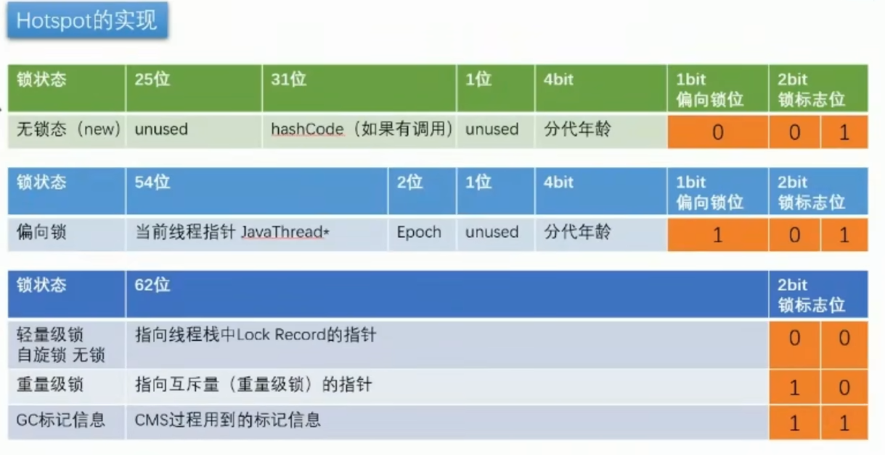
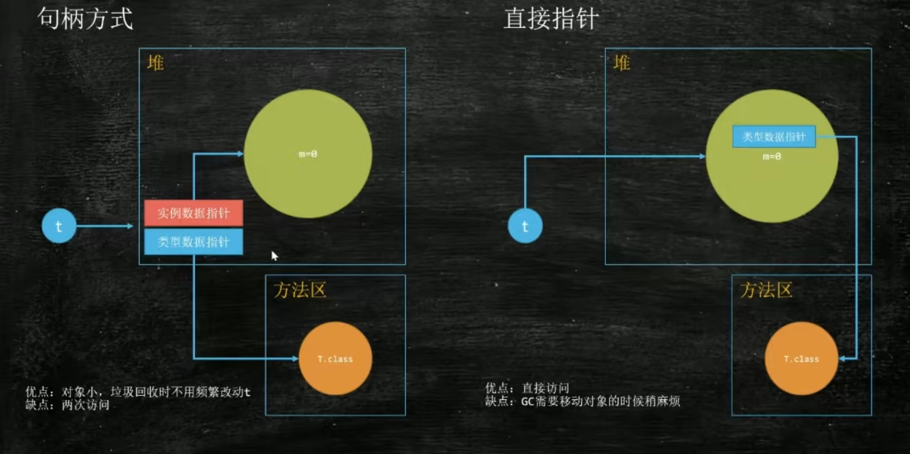
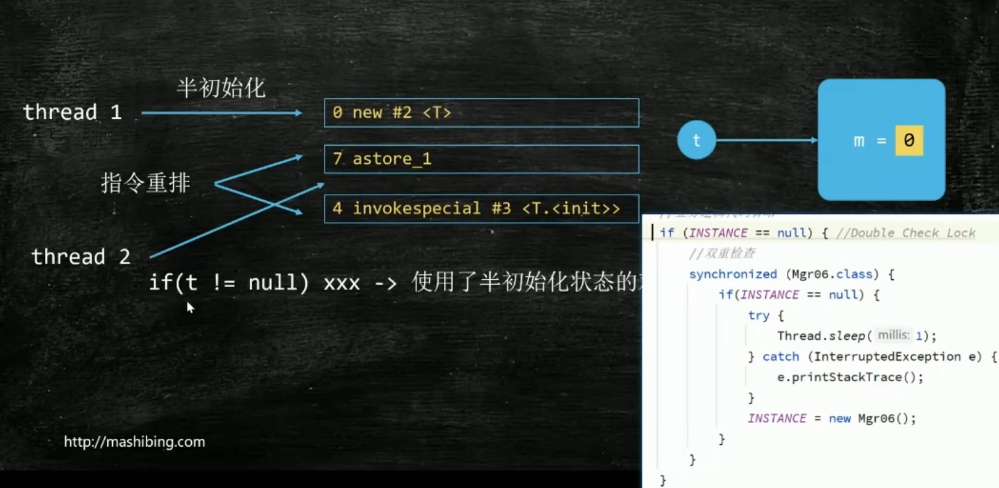

Object o = new Object();

### 对象构成

1. markword 8字节
2. 类型指针 4 或者8字节，Object.class 内存压缩
3. 成员变量 内部的数据类型大小 小于4字节的会内部自动对齐 转成 4字节
4. 如果是数组 多一部分 长度 4字节
5. 对齐 添加转为向上 被8整出

指针压缩，64 位 用不到，所以压缩成32位 及 4字节

### 对象头： markword 与 类型指针

markword : 8个字节，2^64(8*8位)

对象的 hashCode 调用后，就会存储在对象头中

对象被锁使用，也会存储在 对象头中

以及 gc 状态的信息

### 对象定位

常用的直接指针，

还有句柄方式，劣势 慢 优势 GC 对象移动 不需要改变指针

### 对象分配

1. A方法栈中，栈帧执行创建对象
2. 是否可以直接在栈中创建对象？（只是当前方法栈需要对象-逃逸分析）
3. 是直接创建，方法运行完成，直接完成 不需要GC
4. 不能直接栈创建
5. 对象是否大 （最大老年代大小） 
6. 大直接去老年代 
7. 小的 TLAB 给线程分配一个 对应Eden 小区 用来存放对象

### Class对象在什么地方

方法区：永久代 元数据区

C++ 中表示Java对象是 OOP-KLASS 模型，这个模型放在 方法区，对指针指向的类对象是在堆中。反射可以直接找到。

### 对象的创建过程

每种不同的对象，都会方默认值，防止 遗留值的问题。

1. new 申请空间 赋值默认
2. T.init 构造方法，设置初始值 ，赋值一份 到 堆中。源对象 被栈弹出
3. astore_1 对象关联给引用

### DCL要不要加 volatile

DCL: double check lock 双重校验锁

必须要加