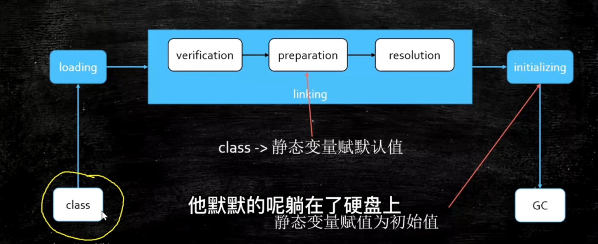
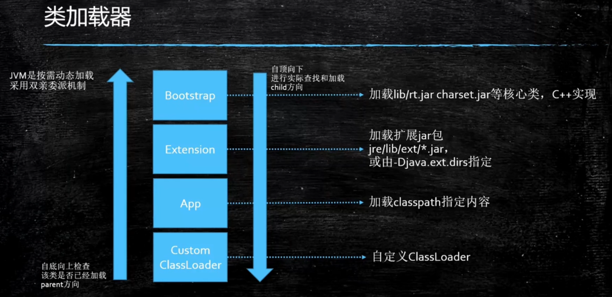
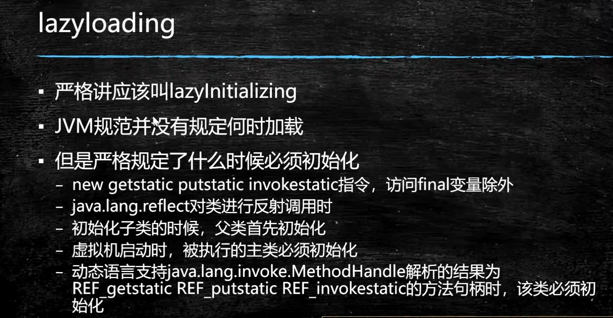

# 三大步骤

1. loading 
2. linking 
   1. verification 验证
   2. preparation 准备 
   3. resolution 决议 常量池中的
3. initializing 

# 类加载器 Loading

加载不同的Class classloader的子类

一个Class加载到内存：二进制数据到内存（mate space），生成一个Class对象（）指向这个内存

方法区：1.8 永久代，1.8+ mate space

类加载器层次，不同的层次加载器 加载不同的 Class



Booststrap 是null 由C++实现，没有对应的Java类 ,String.class 就是这个

## 双亲委派

自定义加载器，内部缓存中没有加载对象时，向上访问**父加载器**是否加载，一直到询问到Booststrap ，然后依次返回结果，到对应的 加载器进行加载。如果没有就是没有找到异常

为什么：为了安全 

父加载器 不是类加载器的加载器 也不是 父类加载器

## 类加载器范围

Lanucher

新的JDK 是 ClassLoaders 指定了 范围

## 自定义类加载器

重写 findClass

## 解释器

解释器 ：默认混合模式，

JIT ： Just in-time compiler  编译成本地代码

开始解释执行，启动快，对热点代码实行检测和编译，进行 变成成本地代码。

-Xmixed 默认混合模式

-Xint 解释模式 启动快，执行稍慢

-Xcomp 编译模式

## lazyloading



# Linking

### verification 验证

Class 文件是否符合规定

### preparation 准备

静态成员变量赋默认值

### resolution 解析

将类 方法 属性等符号引用解析位直接引用 

## Initializing

调用类初始化代码（clinit），初始化静态成员变量

```java
class T {
    public static int count = 2;
    public static T t = new T();
    private T() {
        count++;
    }
}
// T.count 为 3
```
