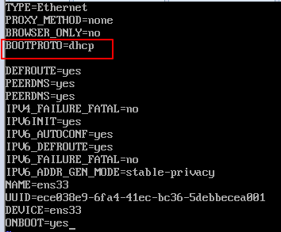
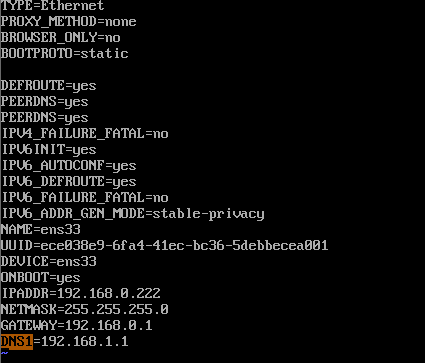

### network

```shell
ifconfig
```

### 启动

```shell
shutdown -r/h now
runlevel # 查看启动级别
init 0-6 # 设置启动级别

service ssh restart # centos 6
systemctl restart sshd # centos 7
```

### 修改 ip

```shell
sudo vim  /etc/sysconfig/network-scripts/ifcfg-ens33
```



```shell

# cd /etc/sysconfig/network-scripts

TYPE=Ethernet
BOOTPROTO=static （dhcp）
#配置静态IP，网关，子网掩码
IPADDR=192.168.86.88
NETMASK=255.255.255.0
GATEWAY=192.168.86.2
#取消networkmanager 管理
# NM_CONTROLLED=no

DEFROUTE=yes
PEERDNS=yes
PEERROUTES=yes
IPV4_FAILURE_FATAL=no
IPV6INIT=yes
IPV6_AUTOCONF=yes
IPV6_DEFROUTE=yes
IPV6_PEERDNS=yes
IPV6_PEERROUTES=yes
IPV6_FAILURE_FATAL=no
NAME=eno16777736
UUID=ed246b2b-cc49-4785-a675-feebf70440e7
DEVICE=eno16777736
ONBOOT=yes

# 保存退出后,重启网络服务:
systemctl restart network.service
# service network restart
Restarting network (via systemctl):                 

```




### 重启 网络服务

```shell
service network restart
```

