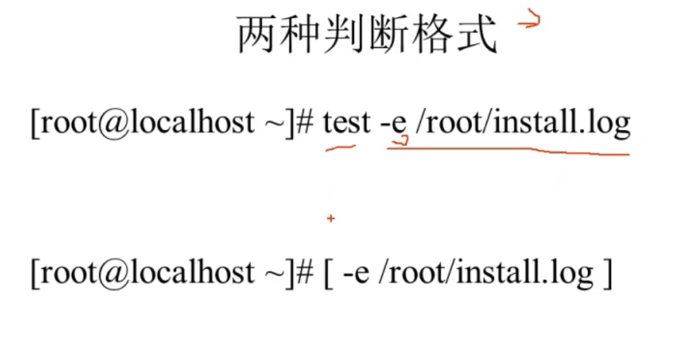

[[TOC]]

# 第十一讲 Shell编程

## 11.1 Shell编程-正则表达式

ls find cp 不支持正则 所有要用 通配符

#### 通配符 ： * ？ []

完全匹配

在Linux中 匹配文件名 ，其他语言通配符 是 属于正则的

*：任意字符 任意个数

？：任意字符 1个

[]：括号中的一个字符

#### 正则表达式

包含匹配

匹配文件中 的 字符串的 grep awk aed 用正则


## 11.2 Shell编程-字符截取命令

grep 从文本中截取出符合 正则的 那一行

cut

awk 

aed

### 11.2.1 Shell编程-字符截取命令-cut命令

提取一列 （） 文本 间隙 为 制表符（\t）


但是 对于多个 空格时 没法了

```shell
cut -d "%" -f 1
```

### 11.2.2 Shell编程-字符截取命令-printf命令

与awk 合用

printf '输出类型输出个数' 输出内容


%ns 看作输出几个字符为一次 空格 默认 会取消  依据n来添加空格

printf '%ns /n'  #(cat xxx)

### 11.2.3 Shell编程-字符截取命令-awk命令

截取符合条件的列，支持正则。而cat 没法。在cat无法达到效果时才用awk，因为awk复杂。

但由于awk，只支持pint输出。


```shell
echo "132 456 789" | awk '{print $2 "\t" $3 }'

//$n 第几列 代表 awk 操作的数据 赋值给print 输出 $0 指该一行
```

**条件：**BEGIN

awk 先读取第一行 再 运行。解决这个问题

**条件：**END

### 11.2.4 Shell编程-字符截取命令-sed命令

在Linux中 轻量级的 流编辑器。sed 主要用来将数据惊喜选取，删除，新增的命令。

不仅可以修改文件。而且可以用管道符 直接修改 命令的结果。vi 不行。

sed [选项] '[动作]' 文件名


```shell
/tmp/guoli]# echo "13 24  56 
sd sdf sdf" | sed -n '2p'
```

## 11.3 Shell编程-字符处理命令


## 11.4 Shell编程-条件判断




```shell
[ -d /root ] && echo "yes" || echo "no"
```


```shell
[ 40 -eq 40 ] && echo "yes" || echo "no"
```


```shell
[ -z 'sdf' ] && echo y || echo n
```

## 11.5 Shell编程-流程控制

### 11.5.1 Shell编程-流程控制-if语句

#### 单分支

```shell
if [ 条件判断 ]；then
    运行语句
fi
或者
if [ 条件判断 ]
    then
        运行
fi
```

#### 双分支

```shell
if [ 条件判断 ]
    then
        运行
    else
        运行
fi
```

#### 多分支

```shell
if [ 条件判断 ]
    then
        运行
    elif [ 条件 ]
        运行
    else
        运行
fi
```

### 11.5.2 Shell编程-流程控制-case语句

```shell
case $变量名 in
    “值1”）
        运行
        ;;//不往下执行
    “值2”）
        运行
        ;;
    *）
        都不行 就执行这个
        ;;
easc
```

### 11.5.3 Shell编程-流程控制-for循环

#### 语法一：

```shell
for 变量 in 值1 值2 值3 值4 # 有多少值 空格区分 执行多少次 每次赋值给变量
    do
        运行
    done
```

```shell
cd /tmp/guoli
ls *.tar.gz > ls.log # 不知道执行次数
for i in $(cat ls.log)
    do
        tar -zxf $i &>/dev/null
    done
rm -rf /tmp/guoli/ls.log
```

#### 语法二

```shell
for (( 初始值;循环控制条件;变量变换))
    do
        运行
    done
```

```shell
s=0
for(( i=1;i<=100;i=i+1))
    do
        s=$(( $s+$i ))
    done
```

### 11.5.4 Shell编程-流程控制-while循环与until循环

#### while循环

```shell
while [ 条件判断 ]
    do
        运行
    done
```

#### until循环

与while 判断相反 判断为真时 不循环