[[TOC]]

# 第十三讲 Linux系统管理

## 13.1 Linux系统管理-进程管理

1. 判断健康状态。
2. 查看系统的所有进程
3. 杀死进程

### 13.1.1 Linux系统管理-进程管理-进程查看

#### 查看

```shell
# ps 查看系统的所有进程
ps aux # 使用BSD操作系统格式 uniux   a:前台 x:后台 u:哪个用户产生的
ps -le # 使用标准Linux标准命令格式
```

aux

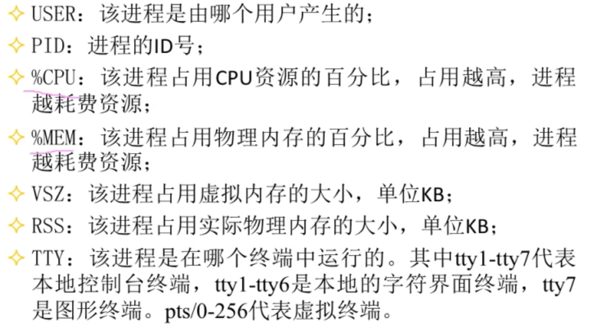

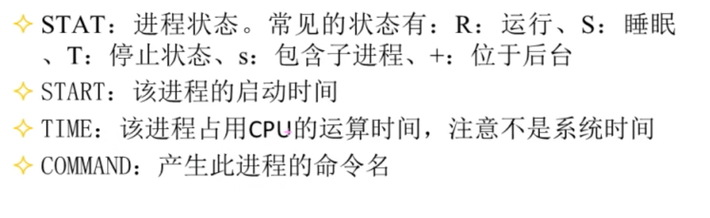

#### 查看健康状态

```shell
top [选项] # -
```

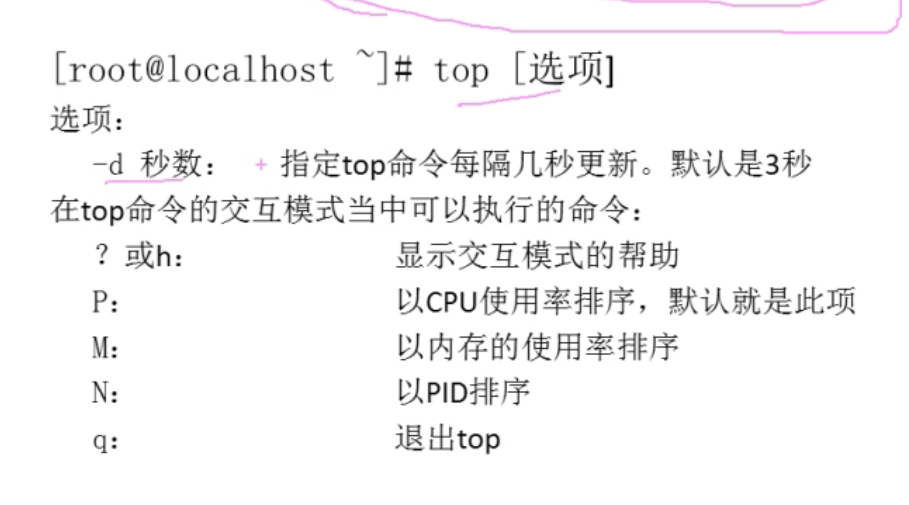

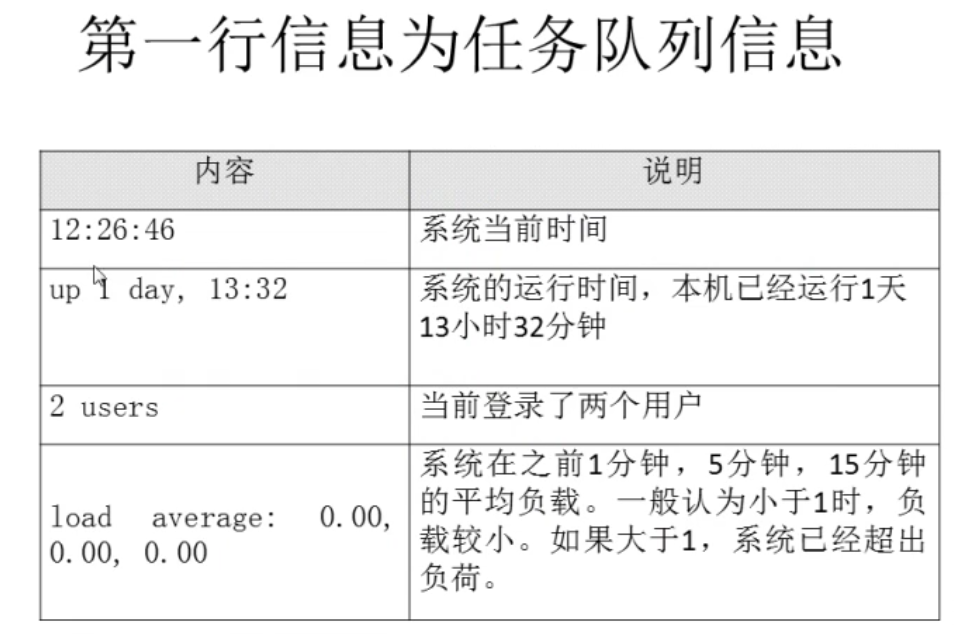

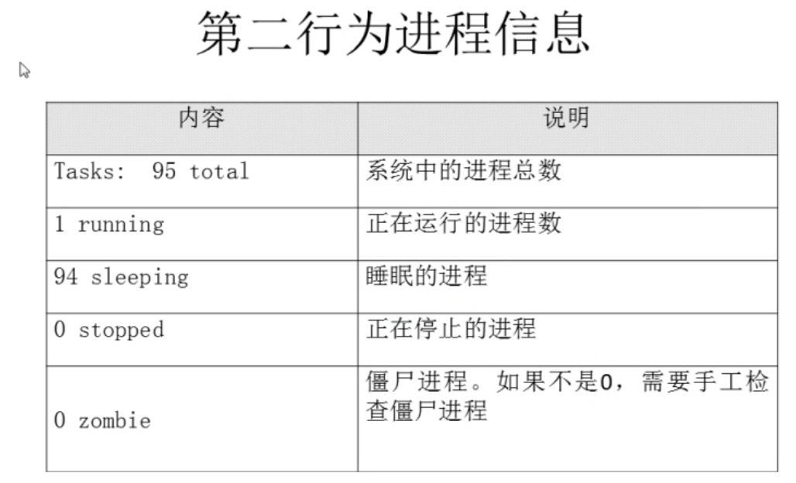

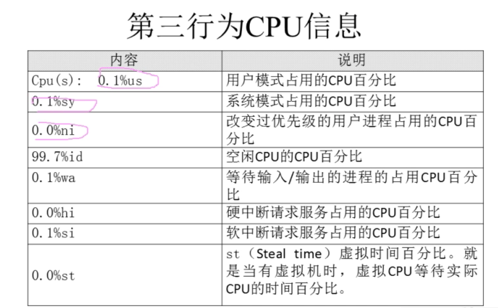

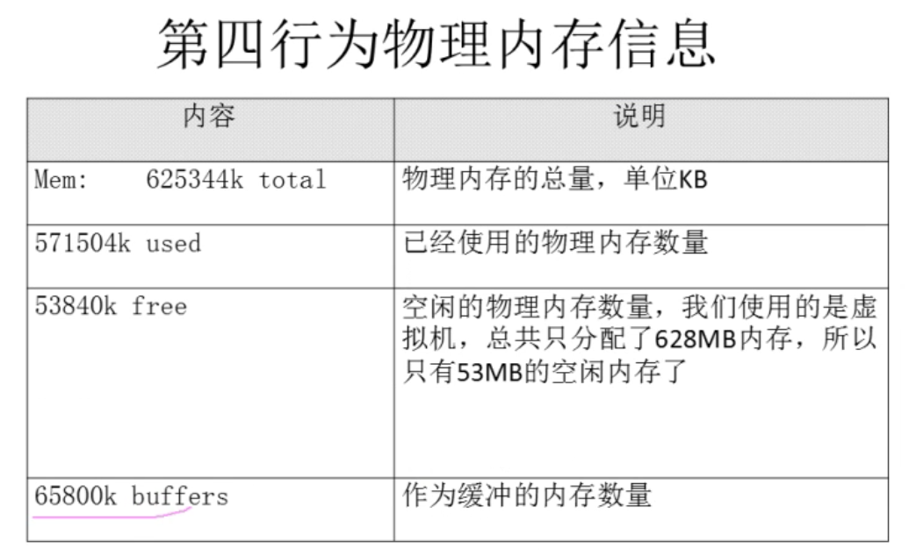

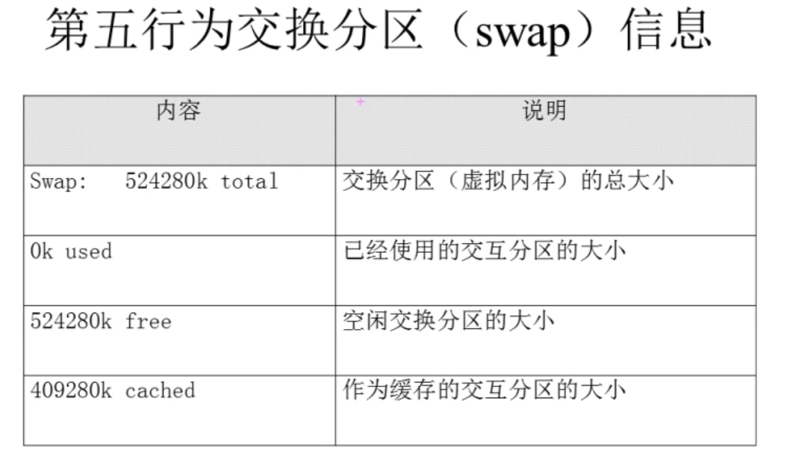

```shell
pstree # 貌似 7 默认没有这个命令
```

### 13.1.2 Linux系统管理-进程管理-终止进程

#### kill

```shell
kill -l # 查看 可用进程信号
kill [-信号码] +pid
```

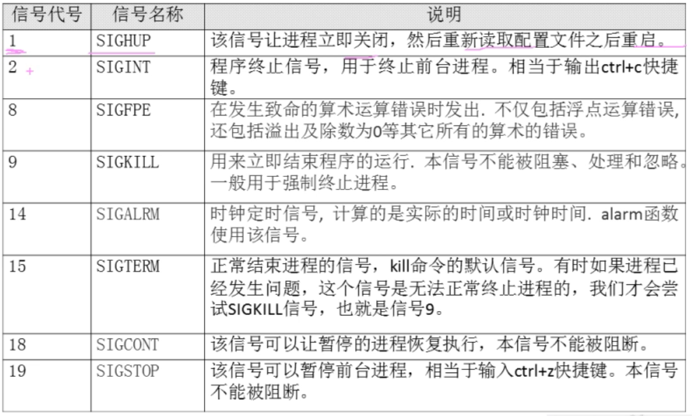

```shell
killall [选项] [信号] 进程名 # -i 询问 -I 进程名忽略大小写

pkill [选项] [信号] 进程名 # -t 按照终端号踢用户 不是标准
# 先 w 
pkill -9 -t tyy1
```

## 13.2 Linux系统管理-工作管理

#### 放入后台

```shell
tar -zcf etc.tar.gz /etc & # 执行命令 后加 &  命令还在运行 

# 或者 ctrl + z  命令会暂停
```

#### 查看后台 暂停

jobs -l  （工作号）

#### 恢复

fg %工作号  （恢复到前台   %可以省略，不写工作号  恢复默认的 ）

bg %工作号 （会复到后台 运行）

## 13.3 Linux系统管理-系统资源查看

```shell
# vmstat [刷新延时 刷新次数] 监控系统资源
vmstat  1 3 # 监视3次 每次间隔1秒
```

```shell
# dmesg 开机时内核检测信息
dmesg | grep CUP
```

```shell
# free 查看内存使用状态
free [-b|-k|-m|-g] # 单位显示
```

```shell
# 查看cup信息：  /proc/cupinfo
```

```shell
# uname 查看系统 和内核信息
uname [选项]
# -a 查看系统所有相关信息
# -r 查看内核版本
# -s 查看内核名称

lsb_release -a  # 查看发行版本   yum provides */lsb_release
cat /etc/centos-release
```

```shell
file /bin/ls #查看 系统位数
```

```shell
# lsof []  列车进程打开或者使用的文件
-c 字符串 # 只列出以字符串开头的进程打开的文件
-u 用户名 # 只列出某个用户的进程打开的文件
-p pid # 列出某个PID进程。。
```

## 13.4 Linux系统管理-系统定时任务

#### crond 服务管理

启动：

``service crond restart``  ``chkconfig crond on``

使用：

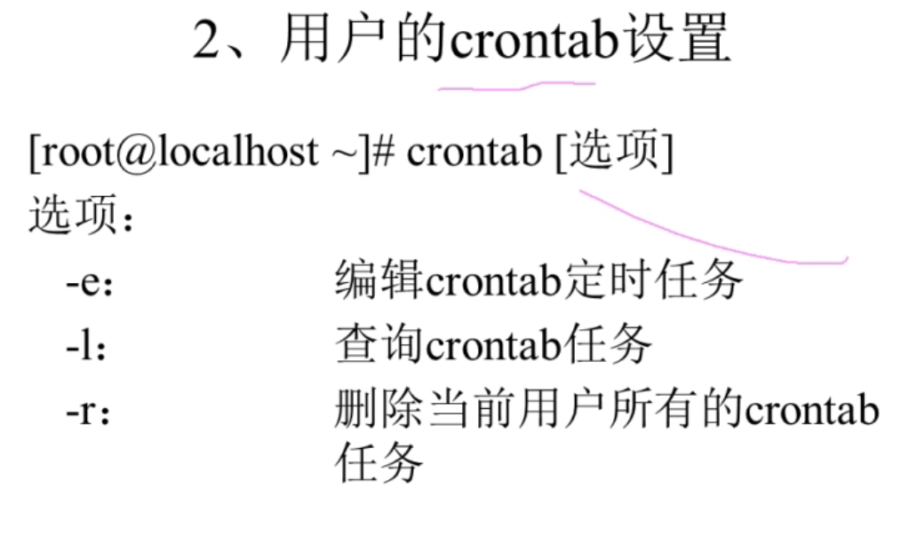

``* * * * * 执行的命令``

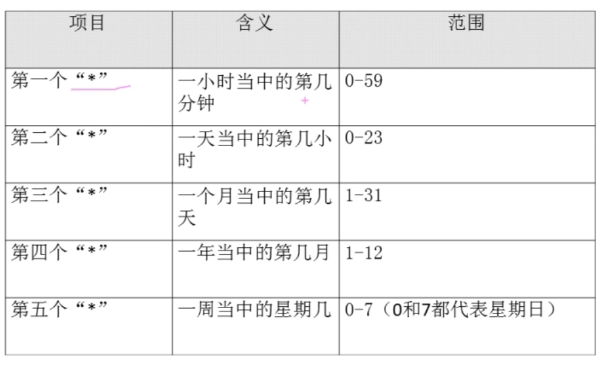

**quartz 用的 就是 Cron表达式表达式  ，只是 这个 只能识别分钟**