[[TOC]]

# 第十四讲 日志管理

## 14.1 日志管理-简介

系统的日志服务程序。

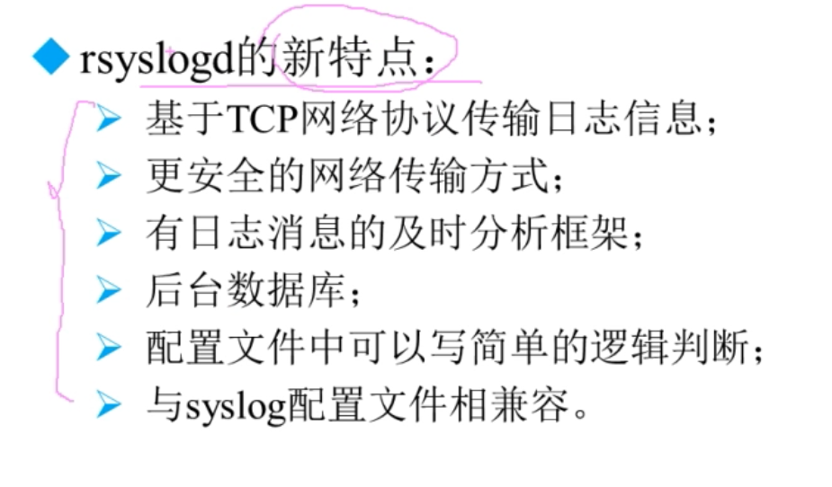

```shell
ps aux | grep rsyslogd

systemctl list-unit-file | grep rsyslog
```

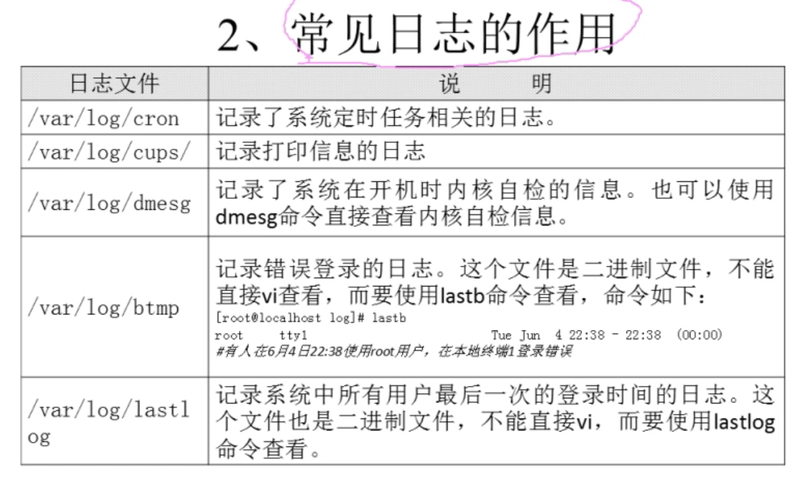

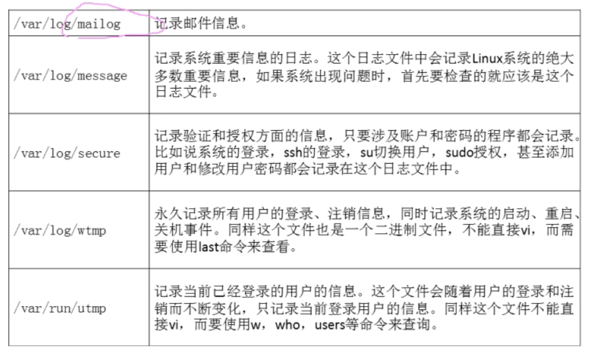

一些以rpm安装的程序，默认 也是会把自己的 日志放在 /var/log/ 下。一般不是rsyslogd产生的。但遵守。

## 14.2 日志管理 -rsyslogd服务

#### 日志文件格式


#### rsyslogd 的配置文件

vim  /etc/rsyslog.conf

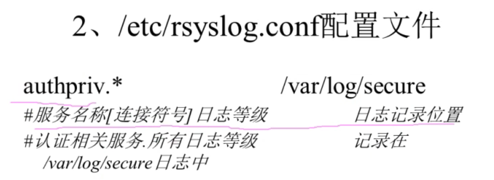

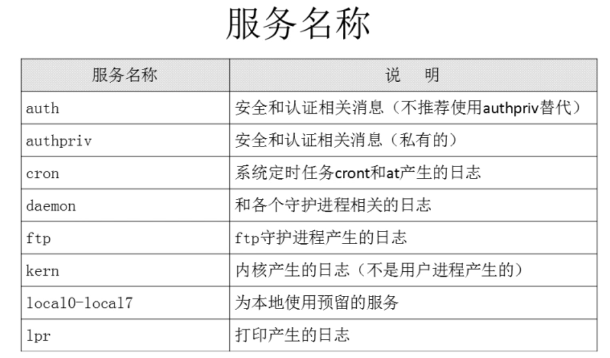

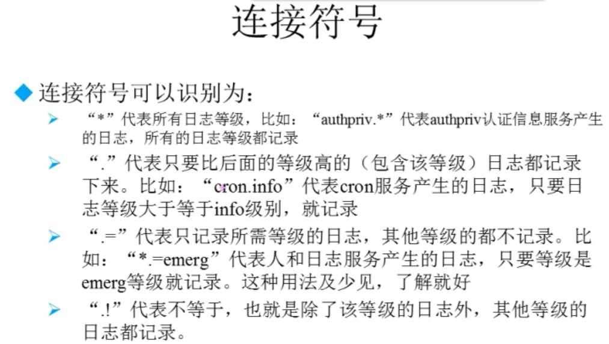

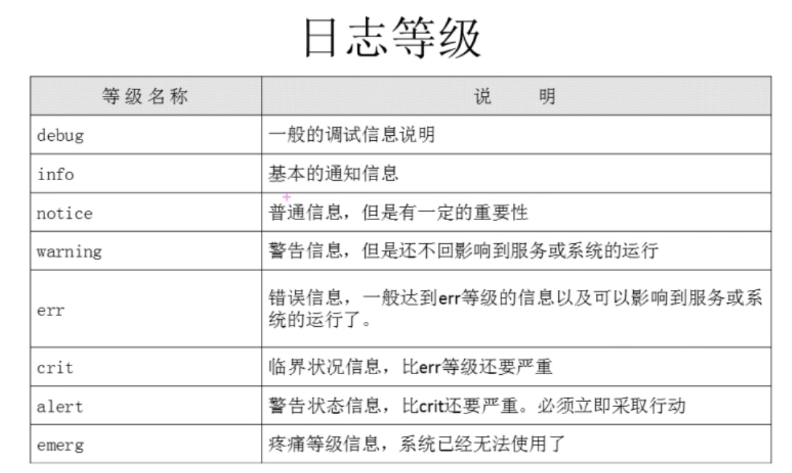

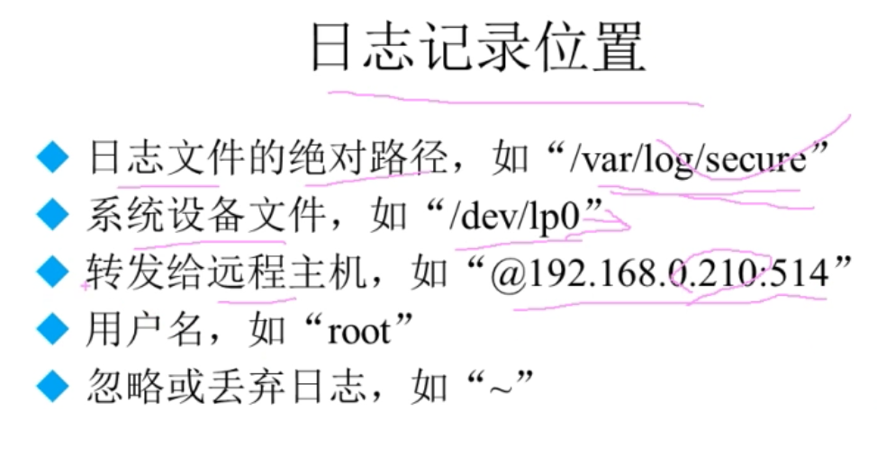

## 14.3 日志管理-日志轮替

日志分割 日志轮换

Linux 自带的日志

#### 日志文件的命名规则

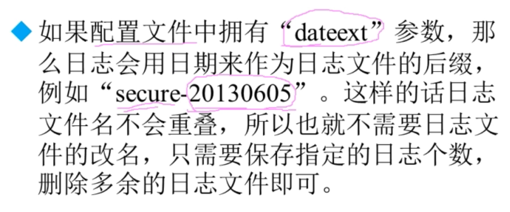

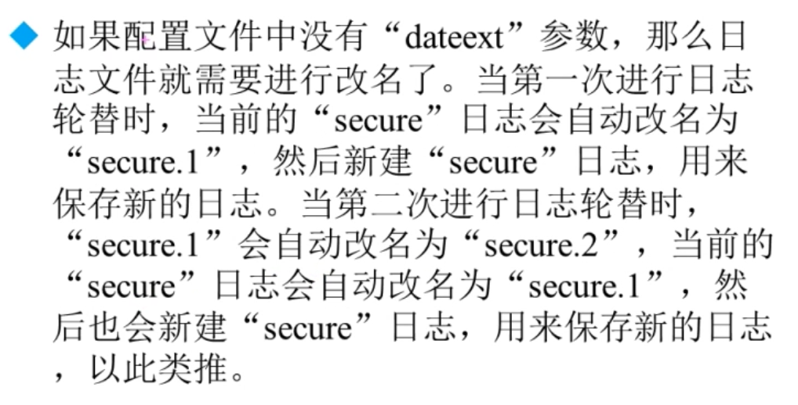

#### 日志轮替工具 logrotate

vim /etc/logrotate.comf

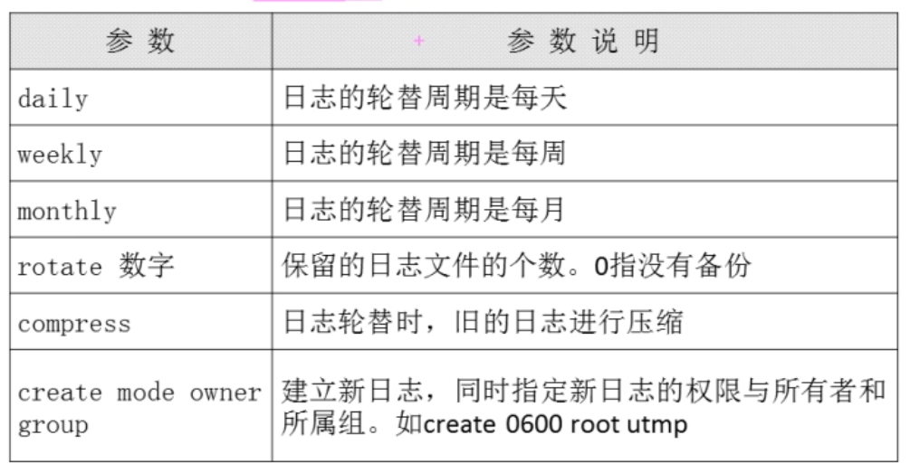

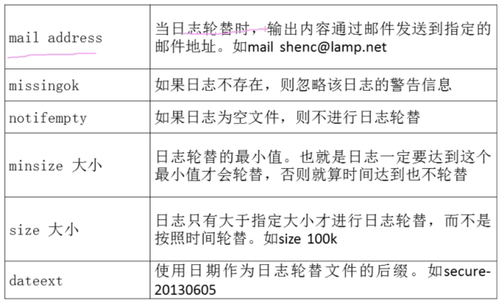

#### 自定义 日志的管理。

只要是rpm安装的 默认都是 /etc/log/ 内  不需要。

源码包安装的：

```shell
/var/log/wtmp { # 软件输出的日志文件 绝对路径
    monthly # 每月
    create 0664 root utmp # 创建的 权限
        minsize 1M # 规定大小
    rotate 1 # 备份多少
}
```

会将原文件备份成新名。并从新建一个空的同名文件。

#### 命令

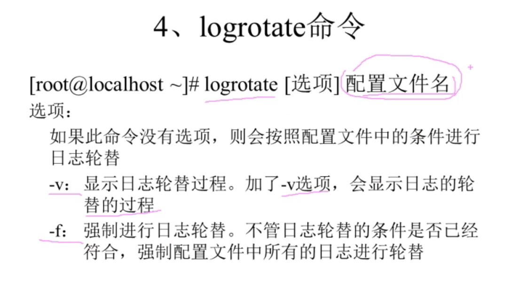