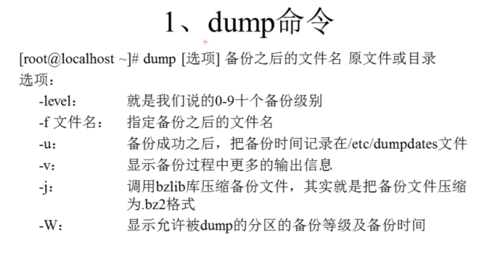
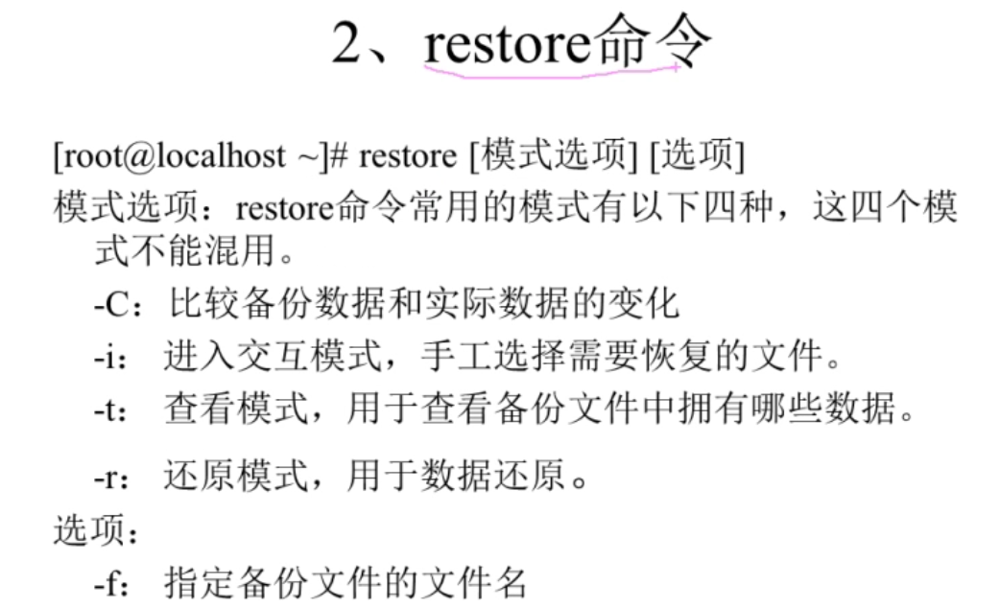

[[TOC]]

# 第十六讲 备份与恢复

## 16.1 备份与恢复-概述

+ /root/目录
+ /home/目录
+ /var/spool/mail/目录
+ /etc/目录
+ 其他

## 16.2 备份与恢复-备份命令

完全备份 ：直接 tar cp 脚本 就可以完成

增量备份：dump 和 restore

`rpm -qa | grep dump`

只能对 分区进行 备份级别。就是0级别

