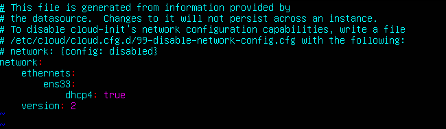
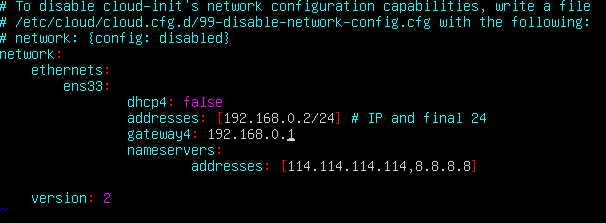

### 16.04 版本 网卡设置

[16.04](https://blog.csdn.net/liuqingsongmsdn2014/article/details/76089871/)

### 18.04  采用netplan作为网络配置管理

1. 打开配置文件

```shell
sudo vim /etc/netplan/50-cloud-init.yaml 
```

没有配置静态IP



2. 写入固定数据



[参考说明](http://blog.sina.com.cn/s/blog_5373bcf40102xk5g.html)

3. 应用 netplan

```shell
sudo netplan apply # Resource temporarily unavailable 文件没有对 或者说gateway（网关 不正确）
shutdown -r now # 重启 -h 关机
reboot # ubuntu 重启
```

4. 或许还需要 再设置 DNS 配置

```shell
sudo vi /etc/resolv.conf
# nameserver 114.114.114.114
```

```shell
sudo dhclient -r # 释放IP

sudo dhclient # 重新获取IP
```
