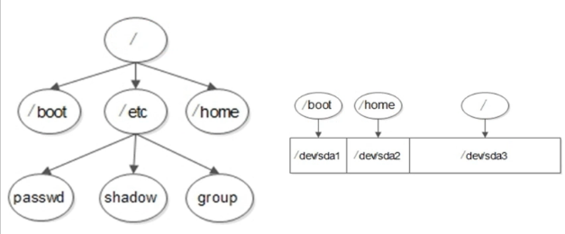

[[TOC]]

# 第二讲 Linux系统安装 #

## 2.1 Linux系统安装-VMware虚拟机安装与使用 ##
## 2.2 Linux系统安装-系统分区 ##
- 主分区最多4个 
- 主分区加扩展分区（一个）最多4个 
- 但是扩展分区不能修改数据，但能放逻辑分区，逻辑分区能够修改数据
- 通过高级格式化存放数据，将盘默认分成4kb大小的小块 

在Linux 分区叫挂载 盘符叫挂载点

/dev/sda1 --指Sata接口 的a 第一块硬盘 的第一个分区 但是1234 是给主分区的 所以说逻辑分区永远是从5开始

- 必须分区
	- /根分区
	- swap分区（交换分区，内存不够时可以用，不超2gb）
- /boot分区

可以给根分区，配一个盘 给根分区的子分区配另外的盘
## 2.3 Linux系统安装-Linux系统安装 ##

基本命令 [https://blog.csdn.net/o0darknessyy0o/article/details/52072054](https://blog.csdn.net/o0darknessyy0o/article/details/52072054)

安装centos7 基本时  要打开联网 
	
	yum install net-tools 
安装ifconfig

安装vmtool

### CentOS7安装后无法使用鼠标选中，复制问题解决：

运行命令：yum install gpm*  安装gpm

启动gpm服务：service gpm start

运行systemctl enable gpm.servicere 添加到后台服务。  

备注：CentOS7服务使用方法

服务使用方法
systemctl start [服务文件名]
systemctl restart [服务文件名]
systemctl stop [服务文件名]
systemctl status [服务文件名]
设置开机启动
systemctl enable [服务文件名]
systemctl disable [服务文件名]

[https://blog.csdn.net/lys07962000/article/details/52716733](http://blog.sina.com.cn/s/blog_626e09150101nh0r.html)
## 2.4 Linux系统安装-远程登录管理工具 ##

traceroute  