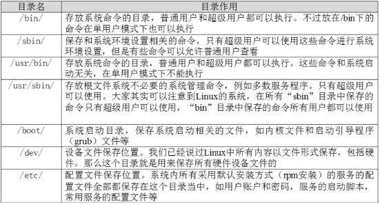
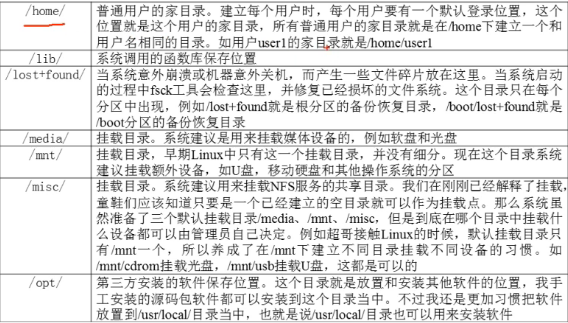
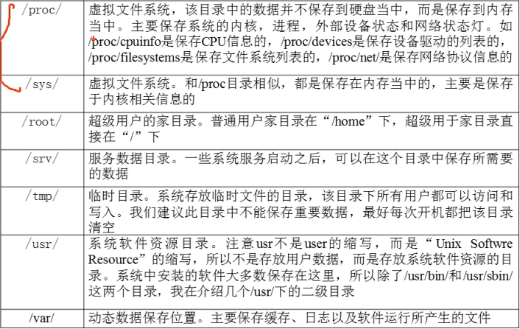

[[TOC]]

# 第三讲 给Linux初学者的建议 #

## 3.1 给初学者的建议-注意事项 ##
	/dev 下管理的硬件 所以的全是以文件保存的
**不是以扩展名来区分类型**

1. 压缩包：.gz .bz2 .tar.bz2  .tgz
2. 二进制软件包： .rpm
3. 网页文件： .html .php
4. 脚本文件： .sh
5. 配置文件： .conf

但是系统不需要识别，而是给管理员看的

**所有的存储设备都必须挂载后才能运行使用，如硬盘，U盘**
## 3.2 给初学者的建议-服务器管理和维护建议 ##

- 有bin 绝大数的二进制命令在里面
- /bin 所有的用户都可以用
- /user/bin 
- 有sbin 自由root 可以使用 
- boot 放的系统内核文件 一般不会存数据到这里
- etc 默认的配置文件存储位置

常用 mnt 和 Usr/local

前俩个是内存 数据写进去没法保存