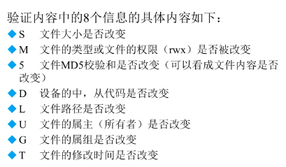
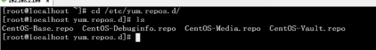

[[TOC]]

# 第六讲 软件包管理

## 6.1 软件包管理-简介

### 源码包 （c语言 及 少量 c++ ）
 需要编译 慢

**脚本安装包**（少）

#### **优点**

- 开源 
- 可以自由选择所需的功能
- 自己系统编译，更稳定
- 卸载方便（直接删除）
#### 缺点

- 安装步骤多，尤其安装大型软件集合时（LAMP环境搭建），易错
- 编译时间长
- 新手对错误难解决
### 二进制包 （编译后的） 
也就是：rpm包 系统默认包
#### 优点
- 包管理系统简单，通过几个命令就可以安装升级 卸载
- 安装速度块
#### 缺点
- 不能看源码
- 功能选择不灵活
- 依赖性
## 6.2 rpm包管理_包命令管理
### 6.2.1 包命令管理与依赖
#### rpm包命名规则
http-2.2.15-15.el6.centos.1.i686.rpm

 名 | 意 
------|-----
httpd|软件包名
2.2.15|版本
15|发布次数
el6.centos|适合的平台
i686|适合的硬件
rpm|意名
#### 依赖性
+ 树形依赖 a->b->c
+ 环形依赖 a->b->c->a (一条命令 一起装)
+ 模块依赖 www.rpmfind.net （so.数字结尾）

### 6.2.2 rpm命令管理-安装升级与卸载
包全名：操作包没有安装的包时，还要注意路径（安装升级）

包名：以及安装的（到/var/lib/rpm/ 搜索） 查询卸载

**安装**

	rpm -ivh 包全名
	-i //安装
	-v //详细信息
	-h //hash 安装进度
**升级**

     dfsdf
    
    rpm -Uvh 包全名 
**卸载** 任何位置
	rpm -e 包名
### 6.2.3 rpm命令管理-查询
	rpm -q/a 包名 //查询是否安装
	rpm -a //查询所有
	
	rpm -qi 包名 //安装的基本信息
	rpm -qip 包全名 //未安装的基本信息
	
	rpm -ql //查询包中文件安装位置
	
	rpm -qf 文件名 //查询文件属于哪个包
	
	rpm -qR 包名 //查询包的依赖性
	rpm -qRP 全包名 
### 6.2.4 rpm命令管理-校验和文件提取

	rpm -V 包名 //安装文件是否被修改!

**文件提取**

	rpm2cpio 包全名 | cpio -idv . 文件的绝对路径
## 6.3 rpm包管理——————**yum命令**
### 6.3.1 yum在线管理-IP地址配置和网络yum源

### 6.3.2 yum在线管理-yum命令
	yum list // 可安装包
	yum search 包名 //
	yum -y 包 //
	
	yum -y update 包名 //
	
	yum -y remove 包名 //卸载 但会卸载所有的依赖包 单系统有依赖也会
	
	yum grouplist //可安装 组
	yum groupinstall "组名"
### 6.3.3 yum在线管理-光盘yum源
	mount /dev/cdrom /mnt/cdrom // 光盘挂载到/mnt/cdrom

修改后缀名，不起作用

让光盘yum (CentOS-Media.repo) 生效 

	enable=1
	baseurl = file:///mnt/cdrom
## 6.4 源码包管理
### 6.4.1 源码包与RPM包的区别

|                 | rpm包默认安装路径          |
| --------------- | -------------------------- |
| /etc/           | 配置文件安装位置           |
| /usr/bin/       | 可执行命令安装目录         |
| /usr/lib/       | 程序使用的函数库保存的位置 |
| /usr/share/doc/ | 基本软件使用手册保存位置   |
| /usr/share/man/ | 帮助文件位置               |

**源码包安装位置：**

/usr/local/软件名/  手动安装位置

**启动：**

/绝对路径/服务名称 start

service 服务名 start (红帽专有 rpm 去系统默认的路径中去运行)

### 6.4.2 源码包安装过程

/usr/local/src/  系统预先准备的源码存放位置

解压 进入压缩的目录（大写的 安装与使用说明）

1.  ./configure  --prefi /usr/local/软件名/ 定义安装环境与检测
2. make 编译    （make clean 清空临时文件）
3. make install   //向指定的位置 安装

报错 ：  安装过程必须是停止  并且出现error 提示

## 6.5 脚本安装包

Webmin

+ 脚本安装包并不是独立的软件安装包，常见的安装源码包
+ 人为了把安装过程写成自动安装的脚本，只要执行脚本，定义基本参数，可以完成安装。
+ 类似win下的软件安装

安装步骤：

1. 下载 解压 进入
2. 运行  ./stup.sh