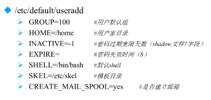
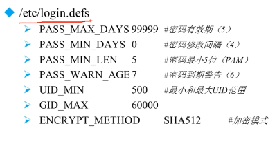
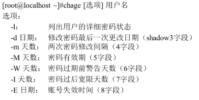

[[TOC]]

# 第七讲 用户和用户组管理

## 7.1 用户配置文件

**简介**

需求建立合理的用户权限等级制度和服务器操作规范

Linux 中主要就是通过用户配置文件来查看和修改用户信息

### 7.1.1用户信息文件 /etc/passwd

用户基本信息 ：

+ 每一行为一个用户 ，具体字段信息“：”隔开
+ 第一个字段：用户名称
+ 第二个字段：密码标志（x 密码 / 不写 没密码 ssh协议只能本机登陆）
+ 第三个字段：UID（用户ID）
  + 0：超级用户
  + 1-499 ： 系统用户（为用户）
  + 500 - 65535 普通用户
+ 第四个字段：GID（用户初始组ID）初始组only one  附加组 多个
+ 第五个字段：用户说明
+ 第六个字段：家目录（超级用户　/root/  普通 /home/用户名/）
+ 第七个字段：用户登陆后的shell （/bin/bash）应用解释器 可以多个 更改

### 7.1.2 影子文件 /etc/shadow

同样是“：”分割字段 就个字段

1. 用户名
2. 密码加密码 （!! * 就不能登陆）
3. 密码最后修改日期 每过一天 加一
4. 和前一次修改 的时间间隔 
5. 密码有效期  相对于3
6. 密码到期提示时间  5-6 开始提示
7. 密码过期宽限天数 0 同不写 -1永不失效
8. 账户失效时间 时间戳 
9. 保留

### 7.1.3 组信息文件 /etc/group /etc/gshadow

**/etc/group ** 用户组 冒号分割

1. 默认情况下 每个用户都有自己的用户组
2. 组的密码 在gshadow (用少 用于小组内 设置组成员)
3. GID 组ID
4. 组中附加用户

## 7.2 用户管理相关文件

修改用户di 来设置普通用户为超级用户 家目录还是原来的 /home/。。

``/var/spool/mail/用户名/`` 用户邮箱地址

``/etc/skel`` 用户模板目录 新用户创建后 就会在家目录下复制这些

## 7.3 用户管理命令

### 7.3.1 用户管理命令-useradd

``useradd 用户名`` 添加用户 再设置密码 （root ）

```
useradd -u UID(数字) 
        -d 目录 //手动指定家目录
        -c 说明 //用户说明
        -g 组名 //手动初始组
        -G 组名 //指定附加组 多个 ， 隔开
        -s shell //默认 bin/bash
```

默认不是这个 而是私有的定义 会自动添加用户名的用户组



默认 可以修改



### 7.3.2 用户管理命令-passwd

```
passwd (选项 可以不写) 用户名 //修改
    -S //查询用户密码状态 只能root使用
    -l //暂时锁定用户 仅root
    -u //解锁 仅root
    --stdin //用户可以通过管道符输出的数据作为用户密码
echo "123" | passwd --stdin lamp
```

### 7.3.3 用户管理命令-usermod和chage

usermod 修改用户信息  选项基本同 useradd  （自由root 权限） -L -U 锁用户

chage 修改用户密码状态



``` chage -d 0 用户名``  用户第一次登陆 后密码就失效 需要重新写

### 7.3.4 用户管理命令-userdel和su

``-userdel (-r 同时删除 家目录) 用户名``

用户身份切换 su 环境变量 需要切换

```
su - root  //完全切换

su - root -c "useradd user" //暂时调用 运行这命令
```

## 7.4 用户组管理命令

groupadd 组名

gpasswd -a 用户名  组名
