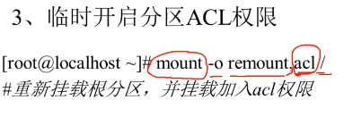
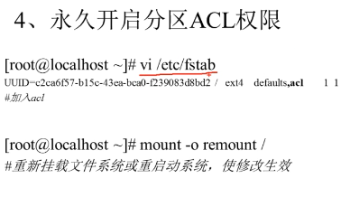
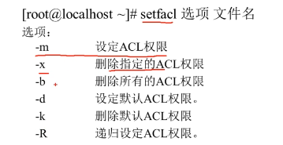

[[TOC]]

# 第八讲 权限管理

## 8.1 ACL权限

文件权限 770 情况下， 有个其他人用户需要 读权限。

acl 就是解决这个问题。 类似 单独地 给文件 添加 额外的用户权限  与基本的 777 不相干

### 8.1.1 简介与开启

支持acl， 是由文件所在的分区是否支持。

``df -h `` 查看当前系统 分区 使用情况

``# dumpe2fs -h /dev/sda3``  来查看分区是否支持。 系统默认 都是开启的



       自动挂载

### 8.1.2 查看与设定

``# getfacl 文件，名`` 查看该文件的acl 权限

``# setfacl 选项 文件名`` 设置文件的acl 权限



```
setfacl -m u:guo:rx guoli
setfacl -m g:guozu:rx guoli
getfacl guoli
```


### 8.1.3 最大有效权限与删除

**mask**权限：用来指定最大有效权限。如果给用户赋予acl权限，需要和mask取 “且”

```
setfacl -m m:r //这样 guo 用户 和用户组 对guoli 文件的 权限最大 只有r
```

```
删除acl 权限
setfacl -x u:guo guoli 

setfacl -b  guoli
```

### 8.1.4 默认与递归ACL权限

```
递归设置 对已有的
setfacl -m u:用户：权限 -R 目录
```

```
默认 对新建的
setfacl -m d:u:用户：权限 -R 目录
```


## 8.2 文件特殊权限

### 8.2.2 SetUID

+ 必须是可以执行的二进制程序才能设置SUID权限(二进制执行，其他没法执行)
+ 命令执行者要对该程序有 X (执行) 权限 （没有 则会显示 S  报错）
+ 命令的执行者，执行该文件时，就会获得 该文件的 所有者 身份 权限
+ 只是在程序执行中有效。也就是说 上一条 

```
passwd 就是一个SetUID  -rwsr-xr-x
在一般用户运行时 获得root 权限 
从而 以root的身份去在shadow 中写入密码
```

设定：

```
chmod 4755 文件名 //设置SUID
chomd 755 文件名
chmod 2755 文件名 //设置SGID
chmod 1755 文件名 //设置SBID

chomd u+s 文件名
chomd u-s 文件名
chomd g+s 文件名
chomd o+t 文件名
```

 尽量不会去设置 SUID （/    /usr）

### 8.2.2 SetGID

针对二进制文件时：基本同SUID   locate 命令

针对目录：

+ 普通用户必须对此目录有r和x权限，才能进入
+ 普通用户在次目录中的有效组变为目录的所属组
+ 普通用户对此目录有w权限时，新建的文件默认为目录的属组

### 8.2.3 Sticky BIT （黏着位）

/tmp  就是


+ 只针对目录
+ 普通用户有w 和x 权限
+ 一旦有了SBIT ，除了root 外 ，普通用户就算有w，也不能删除其他用户的文件。可可以删除自己的

## 8.3 chattr权限

改变一个Linux 文件系统的权限 对root 生效

```
# chattr [+-=] [选项] 文件或者目录名
```

+-=： 增加 删除 等于 某权限
选项：i 

​	对文件：不予许对文件进行删除、改名、添加 修改 数据（啥都不能动）

​	对目录：只能修改目录下文件内容的数据，不允许建立和删除文件

选项：a 

​	对文件：只能在文件中内容增加数据，但不能删除 修改数据

​	对目录： 只允许在目录中建立和修改文件，但不许删除

lsattr -a/d 可以查看

## 8.4 sudo权限

root把本来只能超级用户 执行的 **命令** 赋予普通用户

操作对象 是系统命令

```
# visudo      
guoli All= 一般是root 可以不写  /sbin/shutdown -r now //命令绝对路径 where is
//实际是修改/etc/vidudoers 
```

例子：
1528379144069 未找到
[](C:\Users\一份坚持\AppData\Local\Temp\1528379144069.png)

使用：

```
guoli: $ sudo -l //查看
	   $ sudo /sbin/shutdown -r now
```


