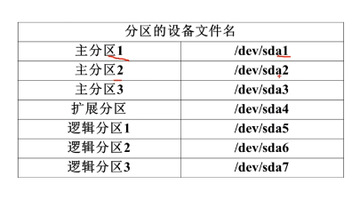
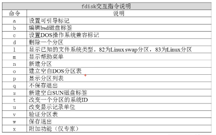

[[TOC]]

# 第九讲 文件系统管理

## 9.1 回顾分区和文件系统

回看  2.2



常为：


ext2:早期的系统分区。最大分区16TB 文件最大 2TB

ext3: 2的升级版，最大区别带日志功能。分区相同

ext4:centos6 以后就是。分区1EB 文件16TB .更好更快更安全。

## 9.2 文件系统常用命令

### 9.2.1 文件系统常用命令-df、du、fsck、dumpe2fs

#### df命令

直接用 查看各个分区的详细信息  -h 人性化显示

#### du 命令

统计目录和文件大小  一般是看目录大小（ll 不全） 高负载命令

```
du 目录绝对路径
du -sad 目录 //看到的会比df小 因为有缓存啥子的
```

#### fsck 命令

文件系统修复命令 开机会自动启动

fsck 选项(-a -y) 分区设备文件名

#### dumpe2fs 命令

看分区的数据块 

### 9.2.2 文件系统常用命令-挂载命令 mount

mount (加或者不加 -l) //显示系统中已经挂载的

mount -a   //依据配置文件/etc/fstab 的内容 自动挂载

手动挂载：

```
mount [-t 文件系统 可选] [-L 卷名称 可选] [-o 特殊选项 可选] 设备文件名 挂载点
mount -o remount,noexec /guo   //重新挂载  并且不能用
mount -o remount,exec /guo   //重新挂载  并且能用
```

### 9.2.3 文件系统常用命令-挂载光盘与U盘

```
创建挂载点：
mkdir /mnt/cdrom  //空目录 都可以

mount 设备文件(/dev/cdrom link /dev/sr0) /mnt/cdrom/

umount 设备文件名/挂载点
```

u盘需要是sdb 分区名 Linux 不支持 ntfs分区

### 9.2.4 文件系统常用命令-支持NTFS文件系统

[](https://blog.csdn.net/lamp_yang_3533/article/details/62414102)

## 9.3 fdisk分区

fdisk -l  //查看 新盘

### 9.3.1 fdisk分区-分区过程

``# dfisk /dev/sdb ``



``# partprobe`` 分区后建议执行

格式化 分区 ``mkfs -t ext4 /dev/sdb1``

再挂载 （每次重启都要）

### 9.3.2 fdisk分区-自动挂载与fstab文件修复

#### 自动挂载

写入 /etc/fstab 文件 重要 不能写错

1. 设备文件名或者UUID （dumpe2fs 看）
2. 挂载点
3. 默认的格式
4. 文件权限 （挂载权限）
5. 分区是否自动备份 0 不 1 要 2不定期 （lostfund）
6. 分区是否 fsck检查 0不 其他 从小到大 2+

#### 修复

mount -a 自动挂载看 报错没 错了 可以就 root 来 mount -o remount,exec /etc/fstab

## 9.4 分配swap分区

查询swap /内存 大小：free

新建(9.3.1)一个分区。修改id 为82 

swapon 新分区名字

swapoff ... //q取消

/etc/fstab中 挂载：

挂载点为 swap 