[[TOC]]

# 第十讲 Shell基础

## 10.1 概述

命令的解释器。和内核间交互的命令。

在Linux 中，也是编程语言。

可以直接调用Linux 中的所有命令

分类：

+ Bourne shell:B shell.早 
  + sh ksh psh zsh **Bash**
+ C shell :语法类似C 语言 与B 完全不兼容
  + csh tcsh
+ **Bash** Linux主流 约等于 sh

cat   /etc/shells      //查询系统的shell

## 10.2 脚本执行方式

echo //输出命令

```
echo 'hell word!'
echo -e "ab\bc"
```

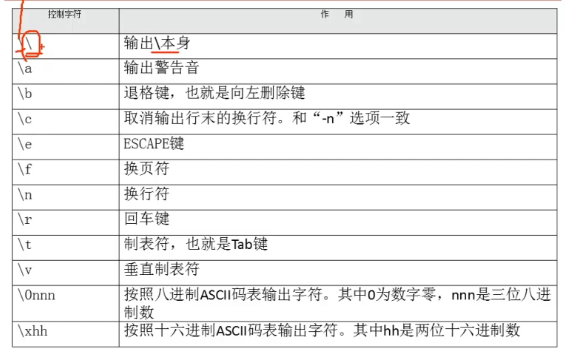

脚本  建议 xxx.sh

```
# vi xxx.sh
#!/bin/bash
```

执行脚本：1. 755 权限后  直接 路径 	2.用bash调用执行脚本(不用执行权限)

dos2unix xx.sh

## 10.3 Bash基本功能

### 10.3.1 历史命令与补全

#### 历史命令

history 查看 使用过的命令

history -c  //清空所有

-w [保存命令的文件]  //写入 默认 在家目录下  ~/.bash_history 默认在退出时 

默认1000条 /etc/profile  环境变量文件中可以修改

#### 调用

1. 上下箭头 来
2. ``!n`` 执行第N条
3. "!!" 执行上一条
4. "!字符串" 执行最后一条 以字符串开头的

#### Tab 补全

### 10.3.2 命令的别名与快捷键

#### 别名

```shell
alias 别名='原命令'
alias //查询
```

 执行顺序：

1. 绝对路径 和相对路径 
2. 别名 
3. Bash 内部命令
4. $PATH 环境变量 的外部命令

**永久生效** 修改 /用户家目录/.bashrc

unalias 别名 删除

#### 快捷键

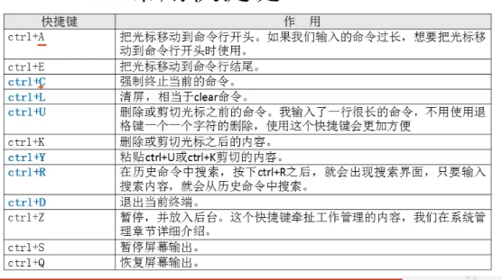

### 10.3.3 输入输出重定向

#### 输出重定向

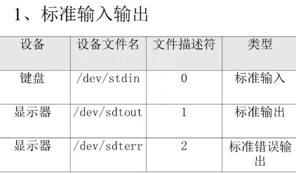

**把命令的结果 保存下来** 例如：``ll > abc`` 

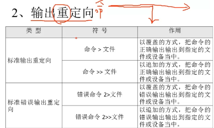

主要用这个

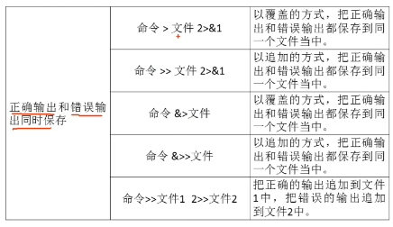

#### 输入重定向

以文件作为数据，不要键盘来。没又输出有用

```
wc [选项] [文件名]
```

### 10.3.4 多命令顺序执行与管道符

#### 多命令顺序执行

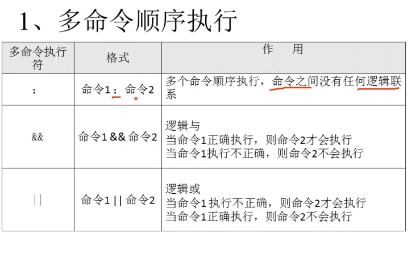

dd 命令 可以复制 磁盘 文件来 文件

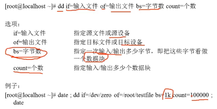

#### 管道符 

命令1  | 命令2 //命令1的输出 为 命令2的操作对象

例如：``ll /etc/ | more``

### 10.3.5 通配符和其他特殊 符号  

#### 通配符

可以代指字符 文件名什么的

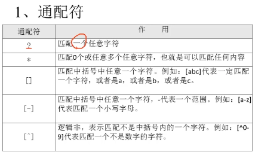

#### 其他符号

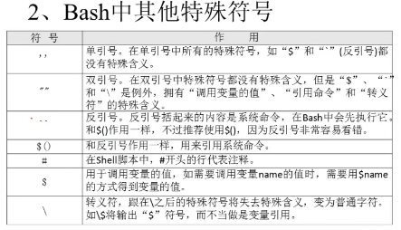

## 10.4 Bash变量

在Bash 中默认 全部都是 字符串型，需要运算，则需要指定；变量名不能数字开头。

赋值时，= 两边不能有空。值间有空格，需要"" '' 包起来。

变量可以叠加。${}$""

引用命令。$()  

环境变量名，。建议大写

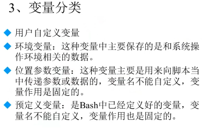

### 10.4.1用户自定义变量

本地变量。

#### 定义

```shell
a=123456
b="132 456"
c='1231456 5464'
输出：
echo $a
```

#### 变量叠加

```shell
aa=123
aa="$aa"456

echo $aa //就是123465
```

#### 查看与调用、删除

echo $变量名

set //查看系统全部变量

unset 变量名 //删除

### 10.4.2 环境变量

自定义变量，只是在当前shell中有用。

环境变量：可以在当前shell和子shell都可以，写入配置文件，对当前计算机的hell都可以用。

系统环境变量：名字不能改变，只可以修改

添加新的环境变量：

```shell
声明：
export 变量名=值
export 自定义变量名

env //查看环境变量

unset 环境变量名
```

##### PATH

系统的命令的路径

##### PS1

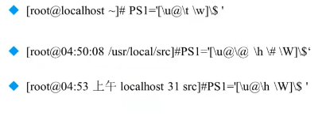

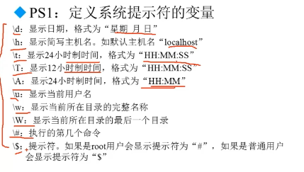

### 10.4.3 参数变量

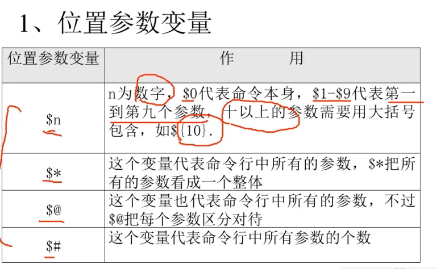

类似公式：$2 $[10]

xx.sh 后的第几位

### 10.4.4 预定义变量

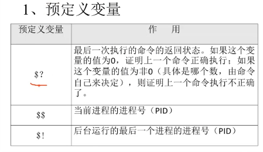

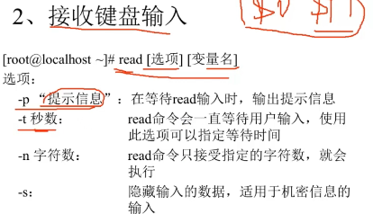

### 10.5.1 数值运算与运算符

``declare [+/-] [选项] 变量名`` 

+ ”-“ 给变量设定类型属性
+ “+” 给变量取消类型属性
+ -i 声明整数型
+ -x 声明环境变量
+ -p 显示变量被声明的类型

#### 数值运算：

一、

​	declare -i a=1+2

二、expr或let 数值运算工具

```shell
a=1
b=2
d=$(expr $a + $b)
```

三、$((运算式))   或者 $[运算式]

```shell
a=1
b=2
c=$(($a+$b))
```

#### 运算符

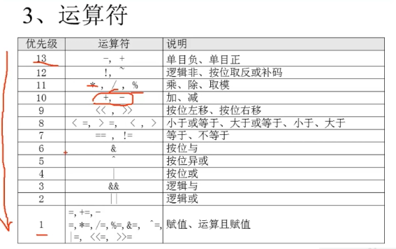

### 10.5.2 变量测试与内容替换

source /etc/...

## 10.6 环境变量配置文件

### 10.6.1 简介

source 配置文件  或者 .配置文件

在修改后 再加载配置文件。不需要重登陆

PATH HISTSIZE PS1 HOSTNAME


在  “/etc” 下的都每个登陆该Linux用户都生效

```
~ 是家目录下 对应每个用户
```

### 10.6.2 作用

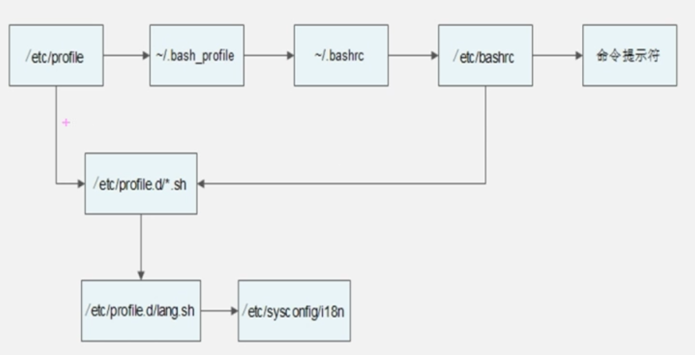

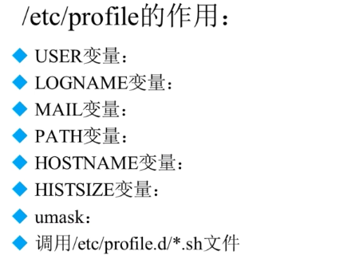

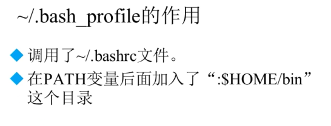

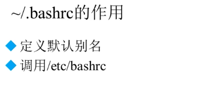

**这个文件是设置不需要用户密码登陆的情况**

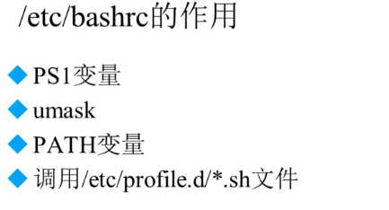

### 10.6.3 其他配置文件和登录信息

注销时生效的环境变量文件   ``~/.bash_logout``

历史命令的保存文件 ``~/bash_history``

#### Shell登陆信息

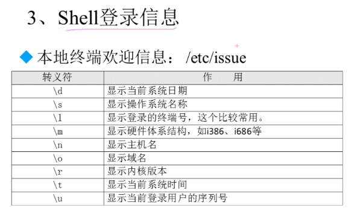

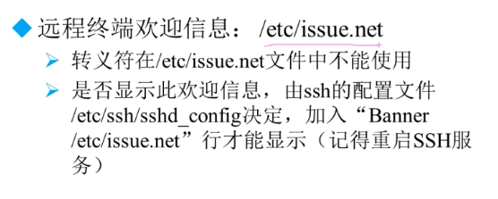


