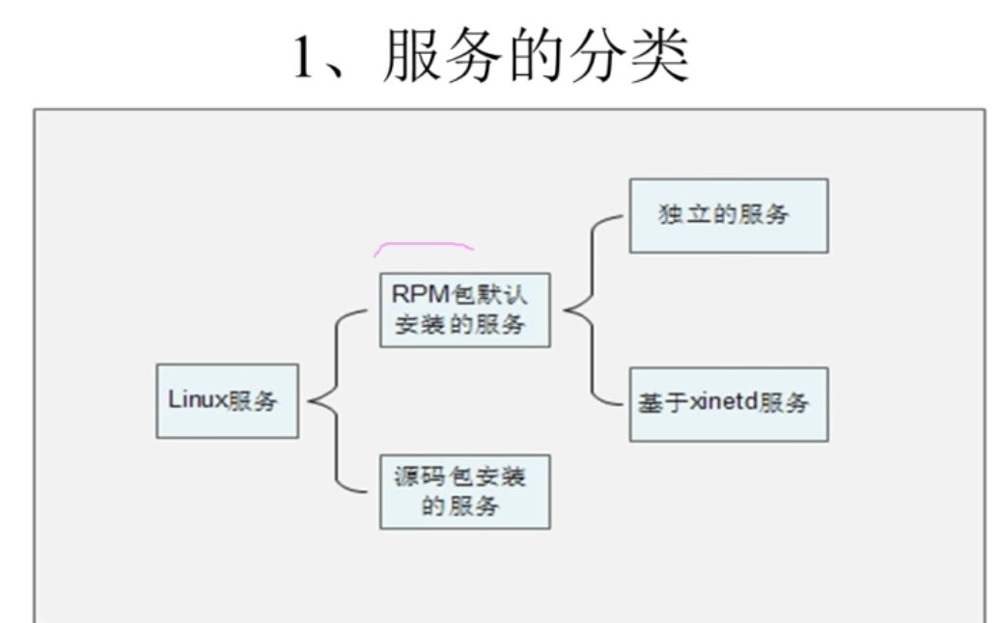
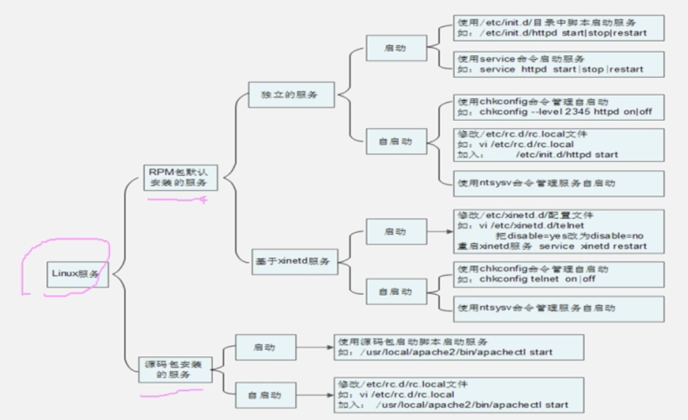

[[TOC]]

# 第十二讲 Linux服务管理

## 12.1 Linux服务管理-服务分类

软件安装的一部分，也就成了系统服务。软件安装就分为 rpm 安装和 源码包 安装。



#### rpm 安装的 。默认服务。

独立服务：响应快，占有资源大。如，apche服务器

基于xinetd服务：xinetd 本身是独立服务。依赖它的服务才是，响应慢，占用资源少。

#### 启动与自启动

查看：

```shell
chkconfig --list # 查看rpm包安装的服务 
systemctl list-unit-files

#源码包一般 在/usr/local/下
systemctl list-unit-files

# 查看 服务当前的运行状态
ps aux | grep ..
next -tlun (不全)
```


## 12.2 Linux服务管理-RPM服务的管理

### 12.2.1 Linux服务管理-RPM服务的管理-独立服务管理

1. /etc/init.d/  所有独立的rpm包安装服务的启动脚本
2. /etc/sysconfig/ 初始化环境配置文件位置
3. /etc/  配置文件位置
4. /etc/xinetd.d/  基于xinetd读完的起点脚本
5. /etc/xinetd.config  xinetd的配置文件
6. /var/lib/  服务产生的数据存放位置
7. /var/log/  日子文件  

#### 独立服务的启动

一般都是绝对路径：/etc/init.d/服务名字 start|stop|status|restart

红帽系统专有：service 独立服务名 start|stop|status|restart

service --starur-all

#### 开机自动启动

```shell
# 第一种 chkconfig
chkconfig --levl 2345 独立服务名称 on # 2345 启动权限  当前不知道是否运行
chkconfig --levl 2345 名 off # 取消自启动
chkconfig  名 off

# 第二种 修改 /etc/rc.d/rc.local 文件 在输入用户名密码前，系统会读取运行该脚本
vi /etc/rc.d/rc.local # 再添加 服务的启动命令 就可以
touch /var/lock/subsys/local # 检查该文件文件 就可以知道系统重启时间

# 使用 ntsysv 命令管理自启动 还可以管理xinetd  但是红帽专有

```

### 12.2.2 Linux服务管理-RPM服务的管理-基于xinetd服务管理

现在很少基于xinted 服务：telnet 不安全。基本没有装 xinted 

## 12.3 Linux服务管理-源码包服务的管理

启动：绝对路径调用启动脚本。安装说明

## 12.4 Linux服务管理-服务管理总结

