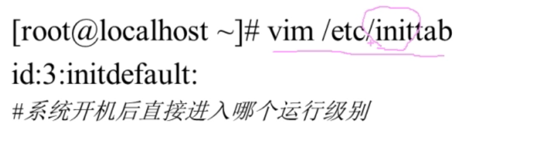
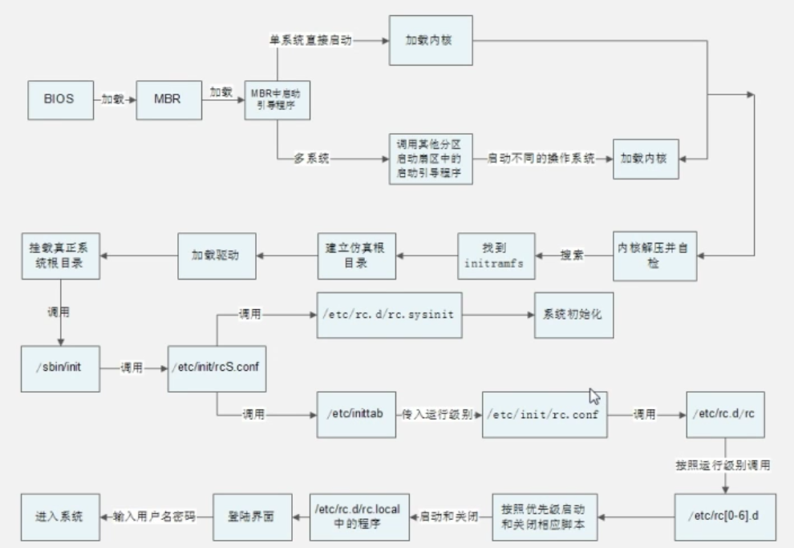
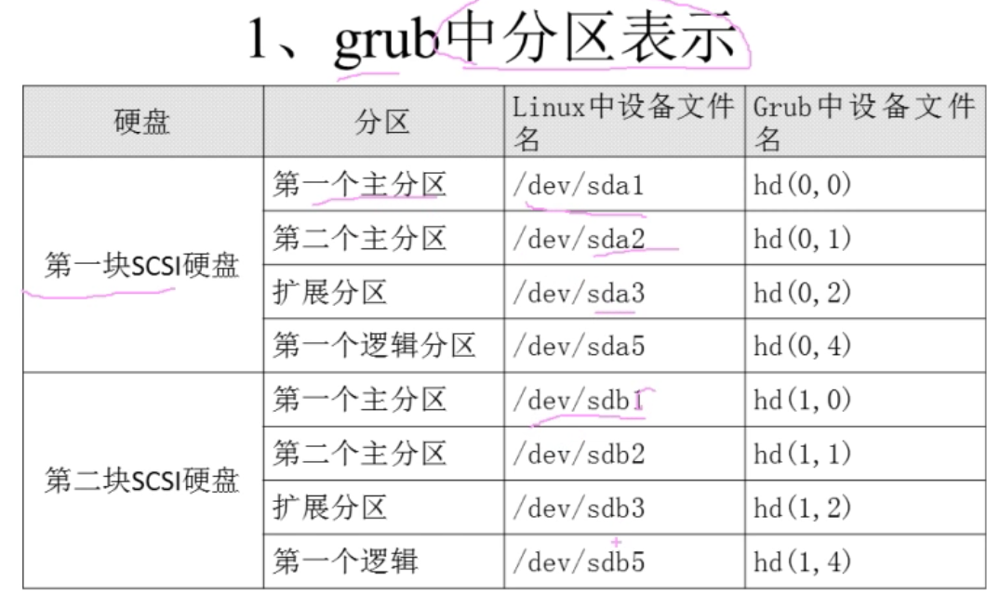
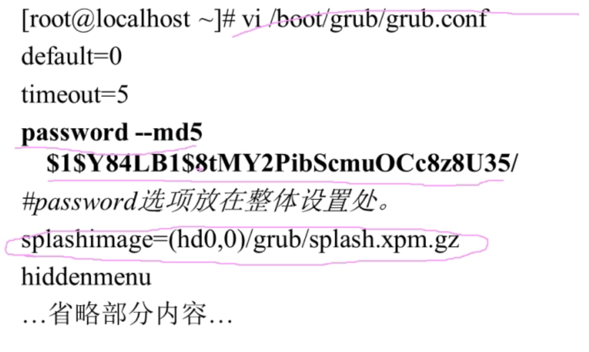
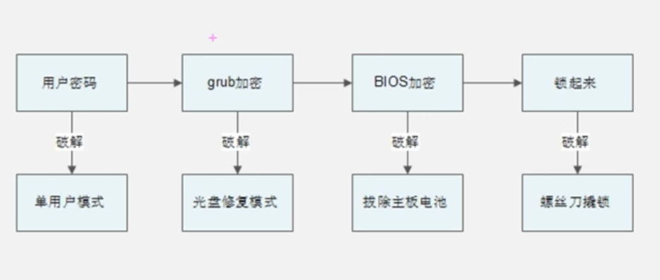

[[TOC]]

# 第十五讲 6.x 启动管理

## 15.1 启动管理-启动流程

### 15.1.1 启动管理-启动流程-运行级别

#### 默认运行级别：

+ 0 关机
+ 1 单用户模式  启动基本服务，用于修复系统
+ 2 命令行模式  没有nfs服务
+ 3 完全模式
+ 4 系统保留
+ 5 图像模式
+ 6 重启

runlevel 查看当前 运行级别 init 修改运行级别

### 15.1.2 启动管理-启动流程-启动过程

6.x启动流程

/lib 驱动  。内核调用。 initarmfs 存放boot  必须的驱动。在mbr就读取。

## 15.2 启动管理-启动引导程序

7.x 配置文档 ：  /boot/grub2/grub.cfg

### 15.2.1 启动管理-启动引导程序-Grub配置文件

/boot/

### 15.2.2 启动管理-启动引导程序-Grub加密

#### grub 加密 

使用的还是 md5 加密：`grub-md5-crypt` 生成加密密码串

#### 字符界面 分辨率

## 15.3 启动管理-系统修复模式

开机进入 grub 界面  修改为单用户模式。 不需要账户登陆，可以直接修改root密码。直接 passwd 用户名 

**光盘启动 **

`chroot /mnt/sysimage` 把系统 作为磁盘文件挂载到光盘系统中

#### Linux 安全性 指网络安全

