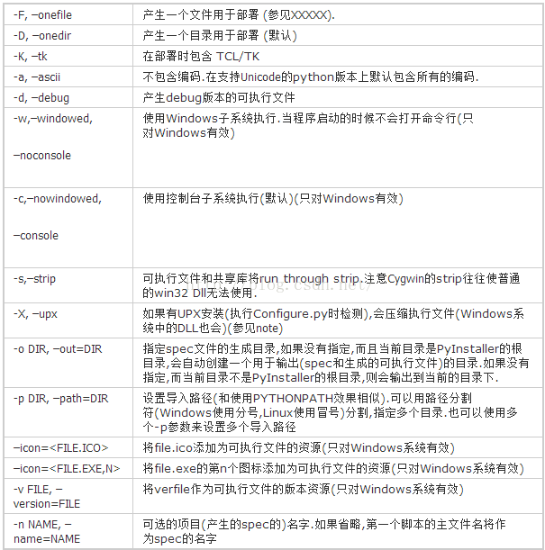

## Python打包成exe了（终极版）

### 安装Pyinstaller

首先我们要先安装Pyinstaller，直接在cmd使用pip命令

```shell
pip install pyinstaller 
```

```shell
Pyinstaller -F -w -i chengzi.ico py_word.py
```

其中`-F`参数代表制作独立的可执行程序。

`-w`是指程序启动的时候不会打开命令行。如果不加-w的参数，就会有黑洞洞的控制台窗口出来。比如在刚才的脚本里我加一行`print('Hello World!')`，那么就不要放-w参数了，不然运行会报错，毕竟`Hello World!`需要在命令行里打印出来。此外，`-w`参数在GUI界面时非常有用。

最后的`-i chengzi.ico`就是指设置自己的图标图案，因为默认打包图片是下图这样的。这个参数也可以写成`--icon=chengzi.ico`

最后稍微总结一下：

```shell
Pyinstaller -F py_word.py 打包exe

Pyinstaller -F -w py_word.py 不带控制台的打包

Pyinstaller -F -w -i chengzi.ico py_word.py 打包指定exe图标打包
```



一个是可以找专门的ico图片网站，不过都很小众，图片库也很小。

另一个是可以自己生成，这里就给大家分享一个网站，可以把其他格式图片转成ico格式：https://app.xunjiepdf.com/img2icon/

### Python打包为什么大？

在压缩打包之前，先简单说一下为什么Python打包过大？

Python打包exe，不但体积大而且运行奇慢。解释型语言大都是这个样子，只不过Python尤其突出。要解决大而慢，只能用编译型语言，如C，C++，甚至VB都好很多，体积最小的是汇编。[1]

此外，还有知乎大佬说是因为“Anaconda里内置了很多库，打包的时候打包了很多不必要的模块进去，要用纯净的Python来打包。”

所以我们可以模拟一个新环境，其中只安装我们本次打包所必要的工具包即可。

那最适合的就是——虚拟环境了！