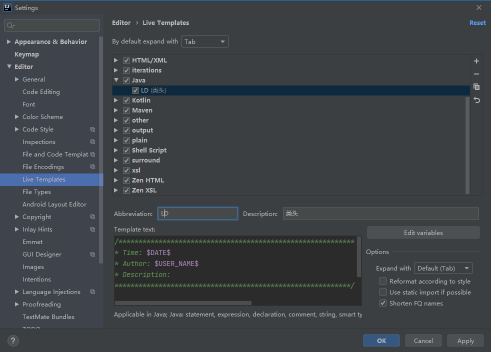

### 社区版本 常用插件

+ Smart Tomcat 启用Tomcat服务
+ IDEA Jetty Runner Jetty同理
+ CodeGlance 右边的代码地图
+ Docker  Docker支持
+ Spring Assistant SpringBoot服务支持
+ Maven helper  Maven依赖树
+ Lombok 
+ **Custom Postfix Templates** 快捷模板
+ decompiler 反编译
+ junit 345 生成工具 `${SOURCEPATH}/../../test/java/${PACKAGE}/${FILENAME}`

### 自定义注释

一、

Setting->File and Code Templates

```text
/**
 * @author: ${USER}
 * @date: ${DATE} ${TIME}
 * @description:
 */
 
 /***********************************************************                                          *
* Time: ${DATE}                                           
* Author: $(USER_NAME)     
* Description:
***********************************************************/
```


二、

File-->Settings-->Editor-->Live Templates   Java

新建模板：命名为*

因为IDEA生成注释的默认方式是：/*+模板名+快捷键（比如若设置模板名为add快捷键用Tab，则生成方式为

/*add+Tab），如果不采用这样的生成方式IDEA中没有内容的方法将不可用，例如获取方法参数的methodParameters(）、获取方法返回值的methodReturnType(）

```text
*
 $param$
 $return$
 * @author: $user$
 * @date: $date$ $time$
 * @description:
 */
```

edit variables 设置参数





param

```text
groovyScript("if(\"${_1}\".length() == 2) {return '';} else {def result=''; def params=\"${_1}\".replaceAll('[\\\\[|\\\\]|\\\\s]', '').split(',').toList();for(i = 0; i < params.size(); i++) {if(i==0){result+='* @param ' + params[i] + ': '}else{result+='\\n' + ' * @param ' + params[i] + ': '}}; return result;}", methodParameters());
```

return

```text
groovyScript("def returnType = \"${_1}\"; def result = '* @return: ' + returnType; return result;", methodReturnType());
```

Help - >Edit Custom VM Options

```
-Duser.name=authorName
```