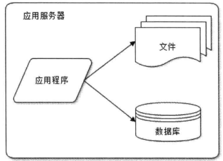
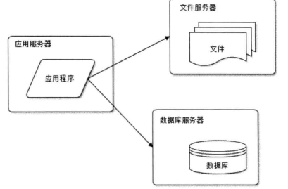
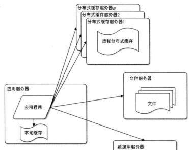
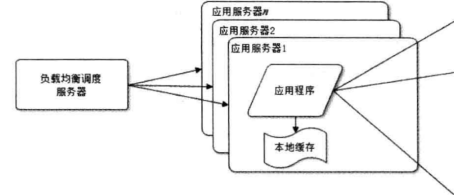
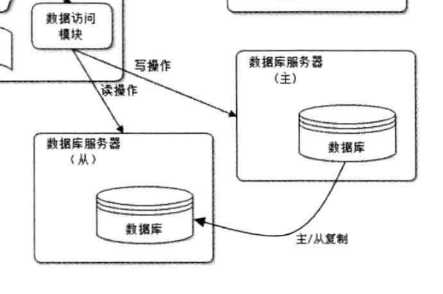
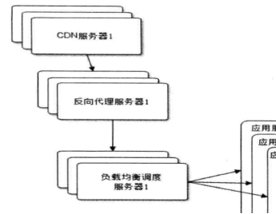
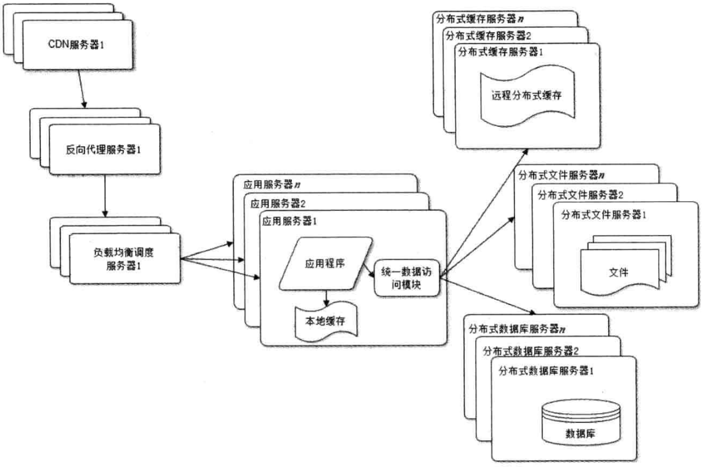
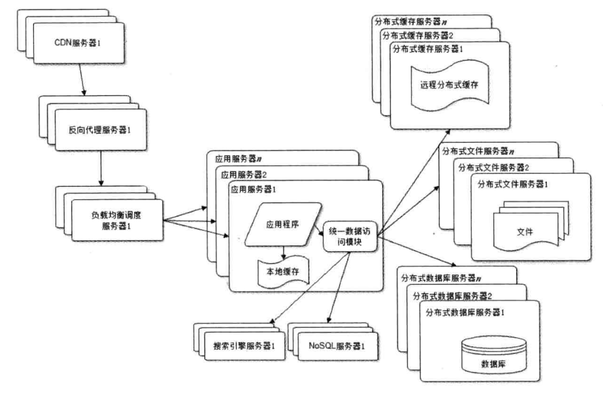
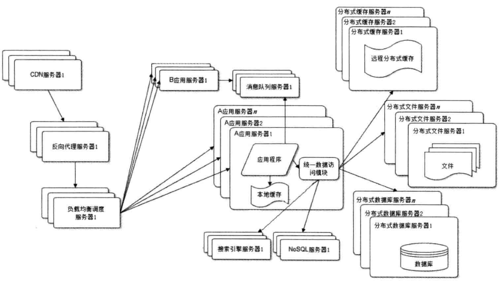
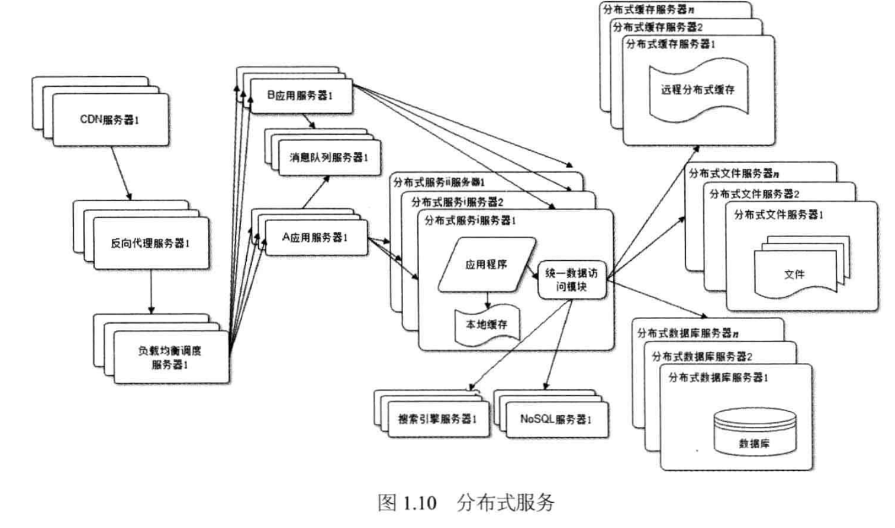

#了解大型网站的框架演化 ##大型网站的特点：

1. 高并发、大流量：就是用户多，访问也多。
2. 高可用：就是出故障时间几乎为零，持久性非常高。
3. 海量数据：顾名思义，数据庞大，
4. 用户及网络复杂：网络问题等，地区不同，导致网络问题哦
5. 要与时俱进：数据更新快；
6. 功能会一直提升，而不是一劳永逸 ##演变过程： ####（一）起步：
   开始，由于资金，用户群，技术方向，等原因，只是把一些基础，搭好。所需的往往只是基本的，比如：一台服务器，MySQL 数据库等一些开源的软件，这时，服务器中包含数据库、应用程序和资源文件
    ####（二）应用和数据的分离：
   让每个服务器专一地为一个功能工作，应为每种更能都需要不同的硬件需求；数据库需要单独服务器，文件需要单独的，应用程序也是单独的
    ####（三）使用缓存改变网站性能：
   数据的缓存要求：高并发的数据、读写比例严重失衡的、不是经常修改的数据。缓存是对数据的提取的快速性的解决方案，减少数据库的负担。但本地缓存往往由于本地的内存等原因，导致性能低下，适应性差。所以就需要第三方缓存，部署大内存的服务器作为专门的缓存服务器
    ####（四）使用服务器集群增加出来高并发的能力：
   一台无论多么顶级的服务器性能都是有限的，当有多个服务器来分担高并发，才能达到效果；通过负载均衡器来负责调度，将用户求分配到某一服务器上；
    ####（五）数据库的读写分离：
   虽然数据读写有缓存，但还是有，比如缓存过期等问题导致要从数据库读取，和全都的增删改。当高并发时，单一的数据库还是无法，达到预期。于是数据库有了“主从热备功能”。
    ####（六）反向代理与 cdn 来加速响应：
   都是运用的缓存 cdn：用户请求时，可在最近的网络提供商获取数据。反向：存在于中心机房，请求会先到达反向，看缓存是否有，有则直接返回，免去挤服务器导致响应慢
    ####（七）使用分布式文件系统和分布式数据库系统
   数据库完成了以上分离后，还是无法满足需求,这是可以使用分布式，但这是对数据库最后的，当单表数据非常大时才使用；
   文件也是一样。

所以一般用的只是文件分布，将不同的文件放在不同的服务器上。
 ####（八）使用 NoSQ 和搜索引擎
数据库的存储与检索愈加复杂，这是可以改变为非关系型数据库和添加搜索引擎，来优化
 ####（九）业务拆分
运用了分而治之；即把不相干的板块化分开来，每个板块独立部署

板块间沟通:1.通过超链接，例如：网站的导航栏。2.通过消息列队进行数据分发。3.最多的还是访问统一数据存储系统来进行关联
 ####（十）分布式服务
业务拆分愈加细，数据库愈加多，也就造成了一次请求，往往会产生多条数据请求，就会造成数据库连接资源不足，其中有许多重复的请求。

把这些重复请求拿出独立部署；再通过分布式服务调用共同的业务完成具体操作

