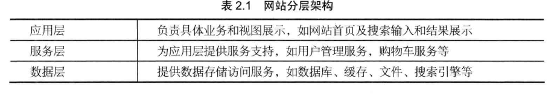

# 大型网站架构的模式 #
模式的关键在于可重复运用性;
## 架构模式细谈 ##
#### (一)分层 ####
将系统按横向维度划分;每个部分的职责相对单一;然后通过上下层的关系,来连接成一个系统.
例如:

但是在分层架构也有挑战,就是合理规划层次的边界和接口,在开发过程中严格遵循分层架构的约束,禁止跨层次调用和逆向调用.
#### (二)分割 ####
类似于分层,但是为竖直方向上的;将不同的单元,例如网站的新闻单元和购物单元,划分开,每个都是独立的单元,有自己独立的业务结构;降低耦合;业务层也可以根据要求来进行自己业务划分.
#### (三)分步式
对于大型网站而言,分层和分割是为了将拆开后的模块分布式部署;即将不同的模块放在不同的服务器上,通过远程协调进行协同工作;

随之而来问题:

- 服务器间通过网络连接,对性能是有所降低的;
- 服务的集群后,功能模块放在上,只要有一台服务器宕机,就会造成整个系统的宕机;
- 分步式预示这数据可能不同步等一些问题;
##### 常用的分步式 ####
######分步式应用和服务  ####
将分层和分割后业务模块分布式部署;
提升网站性能和并发性.加快程序开发和发布速度,减少数据连接资源的 消耗,还可以提高应用复用于共同服务,便于业务扩展;;
######分布式静态资源
比如网站上的css logo js等独立的资源独立分布式部署;即常说的静动态分离;减少服务器压力,不同技术团队分工管理;
######分步式数据和存储
对于大型网站的数据而言,旺旺都是以P为单位的,而服务器无法为海量的数据提供存储空间,故而对数据进行分步式存储.以及因运而生的NoSQL的非关系型数据库.也都是分步式的。
######分布式计算
将计算所要的数据分发到数据所在位置进行加速计算和分布处理
#### (四)集群 ####
服务器的集群是有更多的服务器有相同的服务;当并发时,只需要添加新的有相同服务的机器就能解决问题;同时,一台服务器出问题时,可以由其他服务器来代替工作，减少问题的发生；
#### (五)缓存 ####
是将数据放在离计算较近的位置以加快处理速度；
**cdn:**将数据放在对应的网络代理商处,用户的请求率先到达最近的代理商时,就会去读取缓存的数据。就会快速返回给用户.

**反向代理:**反向代理是将静态数据缓存在反向代理服务器中,当用户要访问静态数据时,先到反向代理,直接返回数据,而不需再想服务器提交请求.加快响应.

**本地缓存:**在应用的服务器本地缓存的热点数据,请求可以直接访问内存中的数据,而不必再去数据中.

**分步式缓存:**将数据缓存在一个专门的分步式缓存集群中;应用程序通过网络通信访问缓存的数据;
#### (六)异步 ####
降低或消除偶很性除了分层 分布 分割,还有异步;

业务间的消息调用不是同步的,而是将一个业务拆分成多个阶段，每个阶段共享数据的异步来进行协同操作；

**提高系统的可用性：**当消费者服务器发生故障时，数据会在消息服务器中列队，而反应是无故障的。待服务器恢复正常后继续处理消息

**加快网站的响应速度：**处在前端的生产者服务器会率先处理消息请求，列队的消息，就不需要消费者服务器处理直接返回。

**消除并发高峰：**将高并发的数据请求放在消息列队中，等待消费这处理器依次解决，
#### (七)冗余 ####
服务器高运行时宕机是肯定的，冗余就是对数据进行备份，实现服务高可用。
#### (八)自动化
在无人值守的情况下，能够正常运行
#### (九)集安全 ####
用户方面：运用密码或者手机绑定来进行，，服务器预防xss攻击  sql注入,数据库有验证,防止重复提交.等

## 小结 ##
模式固然重要,但还是说,照这模子做不一定最合适.自己创新
