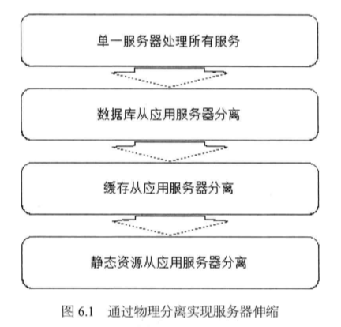
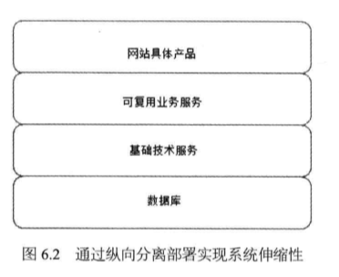
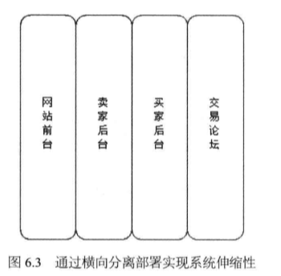
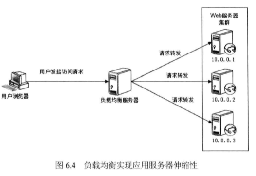
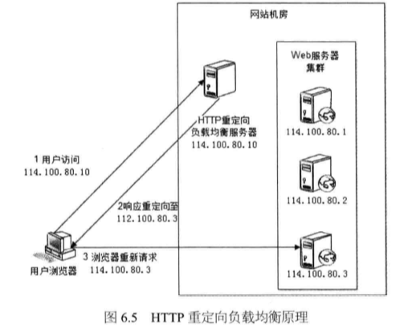
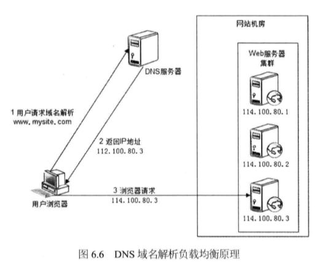

# 第六章（一） 永无止境：网站的伸缩性架构

所谓的网站伸缩性是指不需要改变网站的软硬件设计，仅仅通过改变部署的服务器数量就可以扩大或者缩小网站的服务处理能力。

## 6.1 网站架构的伸缩性设计

一般来说网站的伸缩性设计分为两类：一类根据功能惊喜物理分离实现伸缩，另外一类是单一功能通过集群实现伸缩。前者是不同的服务器部署不同的服务，提供不同的功能，后者是集群内的多台服务器部署相同的服务，提供相同的功能。

### 6.1.1 不同功能进行物理分离实现伸缩

网站发展早期--通过增加服务器提高网站的处理能力时，新增服务器总是从现有的服务器中分离出部分功能和服务。

事实上，通过物理上分离不同的网站功能，实现网站伸缩性手段，不仅可以在网站发展早期，而且可以在网站发展任何阶段，具体又分为两种：

**纵向分离（分成后分离）：**经业务处理流程上不同部分分离部署，实现系统的伸缩性。

**纵向分离（业务分割后分离）：**将不同的业务模块分离部署，实现系统的伸缩性。

### 6.1.2 单一功能通过集群规模实现伸缩

随着网站访问量的逐步增加，即使分离到最小粒度的独立部署，单一的服务器也不能麻醉业务规模要求。因此必须使用服务器集群，即将相同的服务部署在多台服务器上构成一个集群整体对外服务。

## 6.2 应用服务器集群的伸缩性

在五章提到，应用服务器应该设计成无状态的，即应用服务器不存储请求上下问信息，相同应用的服务器组成的集群，每次用户请求都可以发送到集群中任何一个服务器上，返回处理结果都是相同的。

### 6.2.1 HTTP 重定向负载均衡

HTTP 重定向服务器是一台普通的应用服务器，其唯一的功能是根据用户的 HTTP 请求计算一台真实的 web 服务器 地址，并将地址写入 HTTP 重定向响应中（响应状态码 302）返回给用户浏览器。

### 6.2.2DNS 域名解析负载均衡

在 DNS 服务器中配置多个 A 记录，如：www.mysite.com IN A 114.100.80.1 、www.mysite.com IN A 114.100.80.2 、www.mysite.com IN A 114.100.80.3。

每次域名解析请求都会根据复杂均衡算法计算一个不同的 IP 地址返回，这样 A 记录中配置的多个服务器就构成一个集群，并可以实现负载均衡。

图六：用户访问www.mysite.com，DNS据A记录和负载均衡算法计算得到一个IP地址114.100.80.3，返回给浏览器，浏览器在访问真实物流服务器114.100.80.3。

事实上，大型网站总是部分使用 DNS 域名解析器，利用域名解析作为第一级负载均衡手段。
