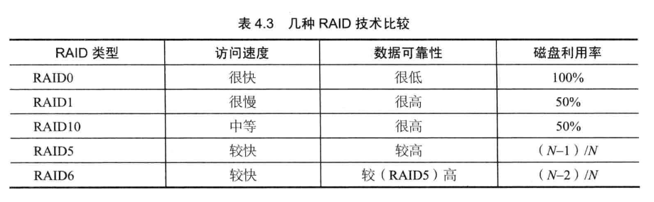

# 第四章:瞬时响应,网站的高性能架构(二) #
## 应用服务器的性能优化 ##
应用服务器就是网站用于处理业务的服务器,这里代码部署,非常复杂.变化多.优化有缓存,集群,异步等
#### 分步式缓存 ####
使用缓存对性能优化,非常显著的提升,但过度使用缓存,反而会对适得其反.
#####不需要缓存的数据
**频繁修改的数据.**数据的读写比例到达2比1.即一次数据要最低有两次读取,一次修改.缓存才有意义.实际可能会达到数千比一.

**没有热点的数据.**如果应用数据访问没有热点,即大部分数据访问并没有集中到小部分数据上.那么缓存就没有意义.

**数据不一致或者脏读.**一般会对缓存数据设置失效时间,一旦超过失效时间,就要从数据库中重新加载,因此应用要容忍一定时间的数据不一致.

**缓存可用数据.**缓存是为提高数据的读取性能,缓存数据丢失或者缓存不可用不会影响到程序的处理,它可以从数据库直接获取数据.但随着业务的发展,缓存会承受大部分数据访问的压力,数据一级习惯 有缓存的日志.所以当缓存服务崩溃时,数据库会因完全不能承受如此大的压力而宕机,进而导致整个网站不可用.

**缓存预热.**缓存中放的是热点数据,热点数据又是缓存数据系统利用LRU(最近最久未用算法.)对不断访问的数据筛选淘汰出来的,这个过程需要花费较长时间.最好在缓存系统启动时就把热点数据加载好.这就是缓存预热.

**缓存穿透.**因为不恰当的业务,或者恶意攻击持续高并发地请求某个不存在的数据,由于缓存没有保持该数据,所以请求会落到数据库中,对数据库造成很大压力,甚至崩溃.对此就是把不存在的数据也缓存起来.(其value值为null)

**分步式缓存架构.**分布式缓存部署在多个服务器组成的集群中,以集群方式提供缓存服务,其架构有两种,一,以JBoss Cache为代表的需要更新同步的分布式缓存,二,以Memcached为代表的不互相通信的分布式缓存.

**Memcached**曾一度是网站分步式缓存的代名词,被大量网站使用.七简单的设计,优异的性能,互不通信的服务器集群,海量数据可伸缩的架构指令.
#### 异步操作 ####
使消息列队化调用异步化.可以改善网站的扩展性.列队化具有消峰作用,将短时间高并发的事务消息储存在消息列队中,从而削平高峰期的并发事务.
#### 使用集群 ####
在网站高并发访问的场景下,使用负载均衡技术为一个应用构建一个有多台服务器组成的服务器集群,将并发访问请求分发到多台服务器上处理,避免单一服务器因负载压力过大而影响缓慢,使用户请求具有更好的响应延迟特性,
#### 代码优化 ####
**多线程.**由于线程比进程更轻量,更少占用系统资源,切换代价小,所以目前web应用服务器都采用多线程的方式响应并发用户请求.因此网站是天然的多线程编程.

**资源复用.**劲量避免开销很大的系统资源的创建和销毁,比如数据库连接,网络通信连接,线程,复杂对象等.从编程角度,资源复用主要用两种模式:单列,和对象池;

**数据结构**早期对程序的定义就是数据结构加算法.灵活组合各种数据结构改善数据类型读写和计算特性可极大优化程序的性能.

**垃圾回收**通过对对象生命周期的观察,发现大部分对象的生命周期都是极短的,这部分对象产生的垃圾应该被更快地收集,以释放内存
## 存储优化 ##
#### 机械硬盘和固态硬盘 ####
在网站应用中,大部分应用访问数据都是随机的,这种情况下ssd具有更好的表现,但ssd的技术不太成熟,可靠性,性价比都不足,
#### B+ 树 和  LSM树####
**对机械硬盘的优化(高速有序读写,随机读写慢):B+树,**是专门针对磁盘存储而优化的N叉有序树,以树阶段为单位存储在磁盘中,从根开始查找数据所在的节点编号和磁盘位置,将其加载到内存中然后继续查找,直到找到所需的数据.
**LSM树可以看作一个N阶合并树,任然是有序树**当数据量超出设定的内存阀值后,会将这棵排序树和磁盘上最新的排序树合并,超过后,再与磁盘上下一级的排序树合并.
#### RAID 和 HDFS ####
**RAID(廉价磁盘冗余阵列):**技术主要是为了改善磁盘的访问延迟,增强磁盘的可用性和容错率.

**HDFS**以块(block)为单位管理文件内容,一个文件被分割成若干个块,当应用程序写文件时,没写完一个块,HDFS就将其自动复制到另外两台机器上,保证每个block有三个副本,技术有两台服务器宕机,数据依然可以访问,相对于实现了raid1的数据恢复功能