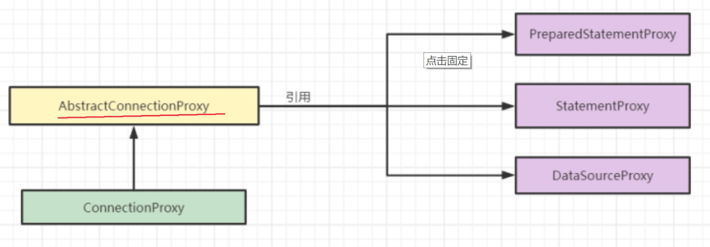
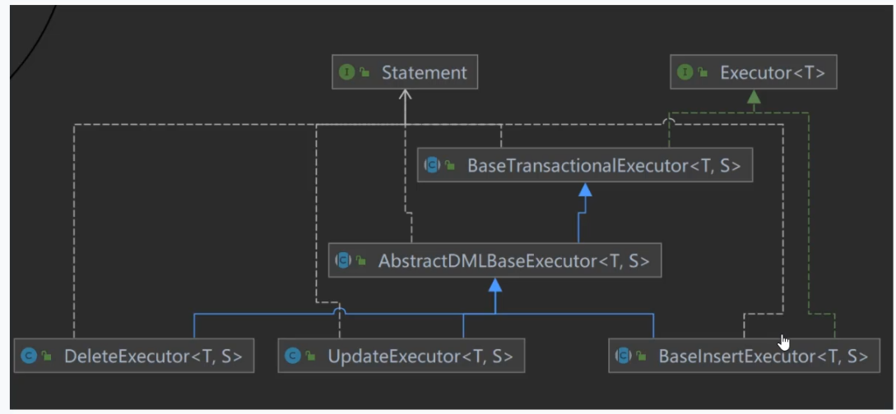

AT 模式

https://mp.weixin.qq.com/s/fzlr-6pDPWKbwVuJlXe8sA

https://www.bilibili.com/video/BV1FL4y1F7x6

## 写隔离

防止脏写：

两个事务，需要对 A表 B数据进行写入，此时 就需要开启全局事务，防止两个事务 冲突导致脏写。

相同服务的两个全局事务 tx1 和 tx2，分别对 a 表的 m 字段进行更新操作，m 的初始值 1000。

tx1 先开始，开启本地事务，拿到本地锁，更新操作 m = 1000 - 100 = 900。本地事务提交前，先拿到该记录的 **全局锁** ，本地提交释放本地锁。
tx2 后开始，开启本地事务，拿到本地锁，更新操作 m = 900 - 100 = 800。本地事务提交前，尝试拿该记录的 **全局锁** ，tx1 全局提交前，该记录的全局锁被 tx1 持有，tx2 需要重试等待 **全局锁** 。

## 读隔离

在数据库本地事务隔离级别 **读已提交（Read Committed）** 或以上的基础上，Seata（AT 模式）的默认全局隔离级别是 **读未提交（Read Uncommitted）** 。

还是全局锁的问题，

相同服务的两个全局事务 tx1 和 tx2，tx1 分别对 a 表的 m 字段进行更新操作， tx2 对其进行读操作。

由于AT模式是两段式提交，若 tx1 服务内提交了，但是全局没有提交。 seata 默认是全局事务的 读未提交（全局事务的未提交），tx2 读的是 tx1 改后的数据，但是 如果 tx1 的全局事务出现了，回滚。那么 tx2 就是脏读。

如果应用在特定场景下，必需要求全局的 **读已提交** ，目前 Seata 的方式是通过 SELECT FOR UPDATE 语句的代理。 **select m from a for update**

## 源码逻辑

启动流程：

1. 自动加载各种Bean配置

2. 初始化 TM

3. 初始化 RM 具体的微服务

4. 初始化分布式事务客户端，代理数据源

5. 连接TC seate服务，注册RM TM

6. 开启全局事务

### 全局事务扫描器

GlobalTransactionAutoConfig --> GlobalTransactionScanner

1. AbstractAutoProxyCreator 继承 AOP 代理 

2. ConfigurationChangeListener 监听器接口

3. InitializingBean Bean 初始化

4. ApplicationContextAware 获取Spring 容器

5. DisposableBean 容器销毁

```java
    private final String applicationId; // 服务名
    private final String txServiceGroup;// 事务分组
```

### Bean 初始化

初始化 TM 与 RM

```java
   private void initClient() {
        ////////////
        //init TM
        TMClient.init(applicationId, txServiceGroup, accessKey, secretKey);
        if (LOGGER.isInfoEnabled()) {
            LOGGER.info("Transaction Manager Client is initialized. applicationId[{}] txServiceGroup[{}]", applicationId, txServiceGroup);
        }
        //init RM
        RMClient.init(applicationId, txServiceGroup);
        if (LOGGER.isInfoEnabled()) {
            LOGGER.info("Resource Manager is initialized. applicationId[{}] txServiceGroup[{}]", applicationId, txServiceGroup);
        }
        /////////////
        registerSpringShutdownHook();

    }
```

### AOP AbstractAutoProxyCreator

wrapIfNecessary 如果需要代理

把标注了 <mark>GlobalTransactional </mark>注册的类生成代理对象，并 织入 <mark>GlobalTransactionalInterceptor</mark>

```java
    protected Object wrapIfNecessary(Object bean, String beanName, Object cacheKey) {
        // do checkers
        if (!doCheckers(bean, beanName)) {
            return bean;
        }

        try {
            synchronized (PROXYED_SET) {
                if (PROXYED_SET.contains(beanName)) {
                    return bean;
                }
                interceptor = null;
                //check TCC proxy
                // 检查是否未 TCC
                if (TCCBeanParserUtils.isTccAutoProxy(bean, beanName, applicationContext)) {
                    // init tcc fence clean task if enable useTccFence
                    TCCBeanParserUtils.initTccFenceCleanTask(TCCBeanParserUtils.getRemotingDesc(beanName), applicationContext);
                    //TCC interceptor, proxy bean of sofa:reference/dubbo:reference, and LocalTCC
                    // 如果是，那么添加 TCC拦截器
                    interceptor = new TccActionInterceptor(TCCBeanParserUtils.getRemotingDesc(beanName));
                    ConfigurationCache.addConfigListener(ConfigurationKeys.DISABLE_GLOBAL_TRANSACTION,
                            (ConfigurationChangeListener)interceptor);
                } else {
                    // 不是 TCC
                    Class<?> serviceInterface = SpringProxyUtils.findTargetClass(bean);
                    Class<?>[] interfacesIfJdk = SpringProxyUtils.findInterfaces(bean);
                    // 是否有相关事务注解
                    if (!existsAnnotation(new Class[]{serviceInterface})
                        && !existsAnnotation(interfacesIfJdk)) {
                        return bean;
                    }

                    // 发现全局事务注解的Bean,添加拦截器
                    if (globalTransactionalInterceptor == null) {
                        globalTransactionalInterceptor = new GlobalTransactionalInterceptor(failureHandlerHook);
                        ConfigurationCache.addConfigListener(
                                ConfigurationKeys.DISABLE_GLOBAL_TRANSACTION,
                                (ConfigurationChangeListener)globalTransactionalInterceptor);
                    }
                    interceptor = globalTransactionalInterceptor;
                }

                // 是否是代理对象
                if (!AopUtils.isAopProxy(bean)) {
                    bean = super.wrapIfNecessary(bean, beanName, cacheKey);
                } else {
                    // 如果是反射获取代理类中的拦截器组合，然后添加集合中
                    AdvisedSupport advised = SpringProxyUtils.getAdvisedSupport(bean);
                    Advisor[] advisor = buildAdvisors(beanName, getAdvicesAndAdvisorsForBean(null, null, null));
                    int pos;
                    for (Advisor avr : advisor) {
                        // Find the position based on the advisor's order, and add to advisors by pos
                        pos = findAddSeataAdvisorPosition(advised, avr);
                        advised.addAdvisor(pos, avr);
                    }
                }
                PROXYED_SET.add(beanName);
                return bean;
            }
        } catch (Exception exx) {
            throw new RuntimeException(exx);
        }
    }
```

### 拦截器 GlobalTransactionalInterceptor

```java
    public Object invoke(final MethodInvocation methodInvocation) throws Throwable {
        // 获取执行的方法
        Class<?> targetClass =
            methodInvocation.getThis() != null ? AopUtils.getTargetClass(methodInvocation.getThis()) : null;
        Method specificMethod = ClassUtils.getMostSpecificMethod(methodInvocation.getMethod(), targetClass);
        if (specificMethod != null && !specificMethod.getDeclaringClass().equals(Object.class)) {
            final Method method = BridgeMethodResolver.findBridgedMethod(specificMethod);
            // 获取GlobalTransactional GlobalLock 全局事务 全局锁 元数据
            final GlobalTransactional globalTransactionalAnnotation =
                getAnnotation(method, targetClass, GlobalTransactional.class);
            // GlobalLock 会将本地事务的执行 纳入 seata 分布式事务的管理，一起竞争全局锁
            // 保证全局事务在执行的时候，本地业务不可以操作全局事务中的记录
            final GlobalLock globalLockAnnotation = getAnnotation(method, targetClass, GlobalLock.class);

            boolean localDisable = disable || (degradeCheck && degradeNum >= degradeCheckAllowTimes);
            if (!localDisable) {
                if (globalTransactionalAnnotation != null || this.aspectTransactional != null) {
                    AspectTransactional transactional;
                    if (globalTransactionalAnnotation != null) {
                        transactional = new AspectTransactional(globalTransactionalAnnotation.timeoutMills(),
                            globalTransactionalAnnotation.name(), globalTransactionalAnnotation.rollbackFor(),
                            globalTransactionalAnnotation.noRollbackForClassName(),
                            globalTransactionalAnnotation.noRollbackFor(),
                            globalTransactionalAnnotation.noRollbackForClassName(),
                            globalTransactionalAnnotation.propagation(),
                            globalTransactionalAnnotation.lockRetryInterval(),
                            globalTransactionalAnnotation.lockRetryTimes());
                    } else {
                        transactional = this.aspectTransactional;
                    }
                    // 执行全局事务
                    return handleGlobalTransaction(methodInvocation, transactional);
                } else if (globalLockAnnotation != null) {
                    // 执行全局锁
                    return handleGlobalLock(methodInvocation, globalLockAnnotation);
                }
            }
        }
        return methodInvocation.proceed();
    }
```

### 执行全局事务 handleGlobalTransaction

获取事务信息，执行全局事务

```java
transactionalTemplate.execute(new TransactionalExecutor(...)
```

1. 获取信息 1PC
   
   1. 获取Xid
   
   2. 根据事务的传播类型 进行
   
   3. 获取当前事务，没有就创建一个新的

2. 开始执行全局事务 1PC
   
   1. tx.begin(txInfo.getTimeOut(), txInfo.getName()); TM对TC发起请求
   
   2. DefaultGlobalTransaction.begin()
   
   3. DefaultTransactionManager.begin(null, null, name, timeout);
   
   4. TmNettyRemotingClient#syncCall getInstance().sendSyncRequest(request); 使用netty 进行通信

3. 2PC 开始， 全局提交 或者 全局回滚
   
   1. 

### 数据源代理 SeataDataSourceAutoConfiguration

1.4.2 是 SeataDataSoureBeanProcessor，1.5.1 是执行的代理创建，

上边已经 执行完成 1PC了

AT模式 ：

 获取全局锁，开启全局事务 √ 1pc

记录 数据，undolog 记录， 资源锁定，都是无感知的，所以都是在代理中完成的

```java
    SeataDataSourceProxy buildProxy(DataSource origin, String proxyMode) {
        if (BranchType.AT.name().equalsIgnoreCase(proxyMode)) {
            return new DataSourceProxy(origin);
        }
        if (BranchType.XA.name().equalsIgnoreCase(proxyMode)) {
            return new DataSourceProxyXA(origin);
        }
        throw new IllegalArgumentException("Unknown dataSourceProxyMode: " + proxyMode);
    }
```

#### 三个增强

1. 为每个数据源标识了数据源组ID

2. 如果配置打开，会有一个定时的线程池 定时更新表的元数据信息并缓存

3. 生成代理连接 ConnectionProxy  getConnection()

```java
    public DataSourceProxy(DataSource targetDataSource) {
        // 数据对象、 默认资源组
        this(targetDataSource, DEFAULT_RESOURCE_GROUP_ID);
    }
    public DataSourceProxy(DataSource targetDataSource, String resourceGroupId) {
        if (targetDataSource instanceof SeataDataSourceProxy) {
            LOGGER.info("Unwrap the target data source, because the type is: {}", targetDataSource.getClass().getName());
            targetDataSource = ((SeataDataSourceProxy) targetDataSource).getTargetDataSource();
        }
        this.targetDataSource = targetDataSource;
        init(targetDataSource, resourceGroupId);
    }

    private void init(DataSource dataSource, String resourceGroupId) {
        // 资源组ID，默认
        this.resourceGroupId = resourceGroupId;
        try (Connection connection = dataSource.getConnection()) {
            // 根据原始数据，得到 JDBC连接 和 数据库类型
            jdbcUrl = connection.getMetaData().getURL();
            dbType = JdbcUtils.getDbType(jdbcUrl);
            if (JdbcConstants.ORACLE.equals(dbType)) {
                userName = connection.getMetaData().getUserName();
            } else if (JdbcConstants.MARIADB.equals(dbType)) {
                dbType = JdbcConstants.MYSQL;
            }
        } catch (SQLException e) {
            throw new IllegalStateException("can not init dataSource", e);
        }
        // 初始化资源ID， 支持 mysql pg oracle
        initResourceId();
        DefaultResourceManager.get().registerResource(this);
        if (ENABLE_TABLE_META_CHECKER_ENABLE) {

            // 如果配置打开，定时线程池会不断更新表的元数据信息
            // 每分钟查询异常数据源的表结构信息并缓存，在需要查询数据库结构时会用到，
            tableMetaExecutor.scheduleAtFixedRate(() -> {
                try (Connection connection = dataSource.getConnection()) {
                    TableMetaCacheFactory.getTableMetaCache(DataSourceProxy.this.getDbType())
                        .refresh(connection, DataSourceProxy.this.getResourceId());
                } catch (Exception ignore) {
                }
            }, 0, TABLE_META_CHECKER_INTERVAL, TimeUnit.MILLISECONDS);
        }

        //Set the default branch type to 'AT' in the RootContext.
        RootContext.setDefaultBranchType(this.getBranchType());
    }
```

三个增强中，只有连接代理，最重要，他会自动记录 undolog  资源锁定等

#### ConnectionProxy 代理



AbstractConnectionProxy

```java
    @Override
    public Statement createStatement() throws SQLException {
        // 调用真实连接对象获取 Statement，执行对象
        Statement targetStatement = getTargetConnection().createStatement();
        // 创建 Statement 代理
        return new StatementProxy(this, targetStatement);
    }

    @Override
    public PreparedStatement prepareStatement(String sql) throws SQLException {
        // 数据库类型
        String dbType = getDbType();
        // support oracle 10.2+
        PreparedStatement targetPreparedStatement = null;
        if (BranchType.AT == RootContext.getBranchType()) {
            // 如果是AT模式，就开启全局事务
            List<SQLRecognizer> sqlRecognizers = SQLVisitorFactory.get(sql, dbType);
            if (sqlRecognizers != null && sqlRecognizers.size() == 1) {
                SQLRecognizer sqlRecognizer = sqlRecognizers.get(0);
                if (sqlRecognizer != null && sqlRecognizer.getSQLType() == SQLType.INSERT) {
                    // 得到表的元数据
                    TableMeta tableMeta = TableMetaCacheFactory.getTableMetaCache(dbType).getTableMeta(getTargetConnection(),
                            sqlRecognizer.getTableName(), getDataSourceProxy().getResourceId());
                    // 得到表的主键列名
                    String[] pkNameArray = new String[tableMeta.getPrimaryKeyOnlyName().size()];
                    tableMeta.getPrimaryKeyOnlyName().toArray(pkNameArray);
                    targetPreparedStatement = getTargetConnection().prepareStatement(sql,pkNameArray);
                }
            }
        }
        if (targetPreparedStatement == null) {
            targetPreparedStatement = getTargetConnection().prepareStatement(sql);
        }
        return new PreparedStatementProxy(this, targetPreparedStatement, sql);
    }paredStatement, sql);
    }
```

StatementProxy 具体执行SQL语句

```java
    @Override
    public ResultSet executeQuery(String sql) throws SQLException {
        this.targetSQL = sql;
        return ExecuteTemplate.execute(this, (statement, args) -> statement.executeQuery((String) args[0]), sql);
    }

    @Override
    public int executeUpdate(String sql) throws SQLException {
        this.targetSQL = sql;
        return ExecuteTemplate.execute(this, (statement, args) -> statement.executeUpdate((String) args[0]), sql);
    }

    @Override
    public boolean execute(String sql) throws SQLException {
        this.targetSQL = sql;
        return ExecuteTemplate.execute(this, (statement, args) -> statement.execute((String) args[0]), sql);
    }
```

#### ExecuteTemplate  AbstractDMLBaseExecutor

根据不同的SQL语句类型的执行模板



BaseTransactionalExecutor

```java
    public T execute(Object... args) throws Throwable {
        String xid = RootContext.getXID();
        if (xid != null) {
            statementProxy.getConnectionProxy().bind(xid);
        }

        statementProxy.getConnectionProxy().setGlobalLockRequire(RootContext.requireGlobalLock());
        return doExecute(args);
    }
```

AbstractDMLBaseExecutor

```java
    public T doExecute(Object... args) throws Throwable {
        AbstractConnectionProxy connectionProxy = statementProxy.getConnectionProxy();
        if (connectionProxy.getAutoCommit()) {
            // 自动提交
            return executeAutoCommitTrue(args);
        } else {
            return executeAutoCommitFalse(args);
        }
     }

    protected T executeAutoCommitTrue(Object[] args) throws Throwable {
        ConnectionProxy connectionProxy = statementProxy.getConnectionProxy();
        try {
            // 更改为手动提交
            connectionProxy.changeAutoCommit();
            return new LockRetryPolicy(connectionProxy).execute(() -> {
                // 调用手动提交方法  得到 分支业务的 最终结果
                T result = executeAutoCommitFalse(args);
                // 提交执行
                connectionProxy.commit();
                return result;
            });
        } catch (Exception e) {
            // when exception occur in finally,this exception will lost, so just print it here
            LOGGER.error("execute executeAutoCommitTrue error:{}", e.getMessage(), e);
            if (!LockRetryPolicy.isLockRetryPolicyBranchRollbackOnConflict()) {
                connectionProxy.getTargetConnection().rollback();
            }
            throw e;
        } finally {
            connectionProxy.getContext().reset();
            connectionProxy.setAutoCommit(true);
        }
    }

    protected T executeAutoCommitFalse(Object[] args) throws Exception {
        if (!JdbcConstants.MYSQL.equalsIgnoreCase(getDbType()) && isMultiPk()) {
            throw new NotSupportYetException("multi pk only support mysql!");
        }
        // 前镜像
        TableRecords beforeImage = beforeImage();
        // 执行具体 SQL
        T result = statementCallback.execute(statementProxy.getTargetStatement(), args);

        int updateCount = statementProxy.getUpdateCount();
        if (updateCount > 0) {
            // 后镜像
            TableRecords afterImage = afterImage(beforeImage);
            // 暂存 Undolog, w为了 在commit时 保存到数据
            prepareUndoLog(beforeImage, afterImage);
        }
        return result;
    }
```

提交子分支事务

ConnectionProxy connectionProxy.commit();

```java
    private void doCommit() throws SQLException {
        // 判断是否是全局事务
        if (context.inGlobalTransaction()) {
            processGlobalTransactionCommit();
        } else if (context.isGlobalLockRequire()) {
            processLocalCommitWithGlobalLocks();
        } else {
            targetConnection.commit();
       }
     private void processGlobalTransactionCommit() throws SQLException {
        try {
            // 注册分支事务
            register();
        } catch (TransactionException e) {
            recognizeLockKeyConflictException(e, context.buildLockKeys());
        }
        try {
            // 写入数据库undolog
            UndoLogManagerFactory.getUndoLogManager(this.getDbType()).flushUndoLogs(this);
            // 执行原生提交
            targetConnection.commit();
        } catch (Throwable ex) {
            LOGGER.error("process connectionProxy commit error: {}", ex.getMessage(), ex);
            report(false);
            throw new SQLException(ex);
        }
        if (IS_REPORT_SUCCESS_ENABLE) {
            report(true);
        }
        context.reset();
    }
```

#### undolog 写入 AbstractUndoLogManager

AbstractUndoLogManager#flushUndoLogs

```java
    public void flushUndoLogs(ConnectionProxy cp) throws SQLException {
        ConnectionContext connectionContext = cp.getContext();
       ........
        // 写入数据具体位置
        insertUndoLogWithNormal(xid, branchId, buildContext(parser.getName(), compressorType), undoLogContent, cp.getTargetConnection());
    }
```

## TC端

使用DB模式，自带三张表：

1. branch_table 分支事务表

2. global_table 全局事务表

3. lock_tabl 全局锁表

1.5.1 启动方式为 springboot + Component     生成 Server的

```java
// 默认协调者
DefaultCoordinator coordinator = DefaultCoordinator.getInstance(nettyRemotingServer);
```

DefaultCoordinator

```java
    @Override
    protected void doGlobalBegin(GlobalBeginRequest request, GlobalBeginResponse response, RpcContext rpcContext)
            throws TransactionException {
        // 处理全局事务开始
        response.setXid(core.begin(rpcContext.getApplicationId(), rpcContext.getTransactionServiceGroup(),
                request.getTransactionName(), request.getTimeout()));
        if (LOGGER.isInfoEnabled()) {
            LOGGER.info("Begin new global transaction applicationId: {},transactionServiceGroup: {}, transactionName: {},timeout:{},xid:{}",
                    rpcContext.getApplicationId(), rpcContext.getTransactionServiceGroup(), request.getTransactionName(), request.getTimeout(), response.getXid());
        }
    }

    @Override
    protected void doGlobalCommit(GlobalCommitRequest request, GlobalCommitResponse response, RpcContext rpcContext)
            throws TransactionException {
        // 全局事务提交
        MDC.put(RootContext.MDC_KEY_XID, request.getXid());
        response.setGlobalStatus(core.commit(request.getXid()));
    }

    @Override
    protected void doGlobalRollback(GlobalRollbackRequest request, GlobalRollbackResponse response,
                                    RpcContext rpcContext) throws TransactionException {
        // 全局事务回滚
        MDC.put(RootContext.MDC_KEY_XID, request.getXid());
        response.setGlobalStatus(core.rollback(request.getXid()));
    }
```

DefaultCore

```java
    public String begin(String applicationId, String transactionServiceGroup, String name, int timeout)
        throws TransactionException {
        // 1.创建全局session
        GlobalSession session = GlobalSession.createGlobalSession(applicationId, transactionServiceGroup, name,
            timeout);
        MDC.put(RootContext.MDC_KEY_XID, session.getXid());

        // 2.为Session添加回调监听 SessionHolder.getRootSessionManager() 去获取一个全局Session管理器
        // 观察者模式
        session.addSessionLifecycleListener(SessionHolder.getRootSessionManager());

        // 3.开始全局事务
        session.begin();

        // transaction start event
        MetricsPublisher.postSessionDoingEvent(session, false);

        return session.getXid();
    }
```
