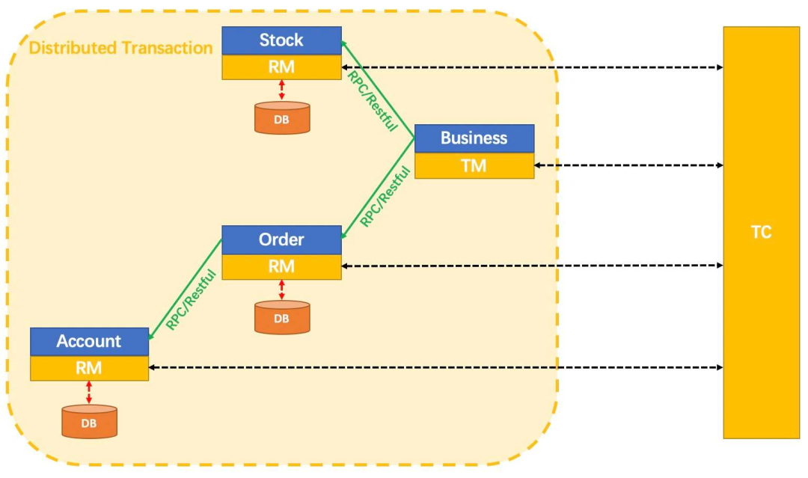

[分布式事务处理方案大 PK！ ](https://my.oschina.net/lenve/blog/5542380)

多个任务，只要有一个任务失败 全部任务都应该失败。 并且高效，即 A任务一执行就失败了，其他任务应当立即停止，而不是 等待完成 再进行回滚

1. 需要一个监听 来管理这些 多任务
2. 如果有一个任务出现问题，监听 应该触发 其他的任务结束的行为
3. 这个结束的行为即线程的结束，最好的办法是，线程自己进行结束，从而 进行数据回滚
4. 这些任务中，需要一个循环的监听 这个监听触发的 结束行为
5. 而这个循环监听，应该每隔一段时间进行，因为 任务中 的一些IO 功能不能打断

2pc tcc 3pc

CompletableFuture 处理异步任务

CompletableFuture.supplyAsync(() -> {}).thenAccept()

## 一、概念 分布式任务

https://mp.weixin.qq.com/s/6DOtO5OQyCL8bR03Z-3q9A

### 反向补偿

对子事务已提交的数据，进行补偿

### Seata 中有三个核心概念：

- TC (Transaction Coordinator) - 事务协调者：维护全局和分支事务的状态，驱动全局事务提交或回滚。

- TM (Transaction Manager) - 事务管理器：定义全局事务的范围，开始全局事务、提交或回滚全局事务。

- RM ( Resource Manager ) - 资源管理器：管理分支事务处理的资源( Resource )，与 TC 交谈以注册分支事务和报告分支事务的状态，并驱动分支事务提交或回滚。

### 两阶段提交

多个操作要同时成功或者同时失败，但是由于多个服务分处于不同服务，因此我们只能先让这三个服务中的操作各自执行，三个服务中的事务**各自执行**就是两阶段中的第一阶段。

第一阶段执行完毕后，先不要急着提交，因为这些服务中有的可能执行失败了，此时需要这些服务各自**把自己一阶段的执行结果报告给一个事务协调者**，事务协调者收到消息后，如果三个服务的一阶段都执行成功了，此时就**通知三个事务分别提交**，如果三个服务中有服务执行失败了，此时就**通知三个事务分别回滚**。

### AT模式

AT 模式是一种全自动的事务回滚模式。

整体上来说，AT 模式是两阶段提交协议的演变：

1. 一阶段：业务数据和回滚日志记录在**同一个本地事务中提交**，释放本地锁和连接资源。

2. 二阶段则分两种情况：
   
   1. 提交异步化，非常快速地完成。
   
   2. 回滚通过一阶段的回滚日志进行反向补偿。

### TCC模式

- 一阶段 prepare 行为
- 二阶段 commit 或 rollback 行为

<mark>类似 MySQL 中，undolog 与 binlog 的二阶段提交行为</mark>

AT 模式（[参考链接 TBD](https://seata.io/zh-cn/docs/overview/what-is-seata.html)）基于 **支持本地 ACID 事务** 的 **关系型数据库**：

- 一阶段 prepare 行为：在本地事务中，一并提交业务数据更新和相应回滚日志记录。
- 二阶段 commit 行为：马上成功结束，**自动** 异步批量清理回滚日志。
- 二阶段 rollback 行为：通过回滚日志，**自动** 生成补偿操作，完成数据回滚。

相应的，TCC 模式，不依赖于底层数据资源的事务支持：

- 一阶段 prepare 行为：调用 **自定义** 的 prepare 逻辑。
- 二阶段 commit 行为：调用 **自定义** 的 commit 逻辑。
- 二阶段 rollback 行为：调用 **自定义** 的 rollback 逻辑。

### XA 模式

基于数据库 规范的

### Saga 模式

saga 模式是 seata 提供的长事务解决方案，然而长事务是我们在开发中应该避免的，因为效率低并且容易造成死锁。