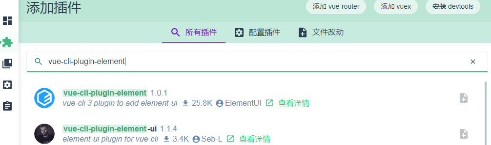

# 1 NodeJS 介绍

Node.js 是一个基于Chrome JavaScript 运行时建立的一个平台。

Node.js是一个事件驱动I/O服务端JavaScript环境，基于Google的V8引擎，V8引擎执行Javascript的速度非常快，性能非常好。

即 执行 JS 脚本的高性能平台。通过NodeJS 的 实现，可以搭建 JS 脚本基础的 服务端。

## 1.1 安装 

略

nvm(Node Version Manager) ，nvm是 Nodejs 版本管理器，它让我们方便的对切换Nodejs 版本。

nvm 介绍：[使用 nvm 管理不同版本的 node 与 npm](https://www.runoob.com/w3cnote/nvm-manager-node-versions.html)

## 1.2 使用

本文不涉及具体 NodeJS 后台服务搭建应用

# 2 NPM 命令

NPM是随同NodeJS一起安装的包管理工具，能解决NodeJS代码部署上的很多问题，常见的使用场景有以下几种：

- 允许用户从NPM服务器下载别人编写的第三方包到本地使用。
- 允许用户从NPM服务器下载并安装别人编写的命令行程序到本地使用。
- 允许用户将自己编写的包或命令行程序上传到NPM服务器供别人使用。

由于新版的nodejs已经集成了npm，所以之前npm也一并安装好了。同样可以通过输入 **"npm -v"** 来测试是否成功安装。命令如下，出现版本提示

## 2.1 设置代理


```shell
npm config set registry=http://registry.npm.taobao.org
```

也可以使用 nvm

```shell
npm install -g nrm  # -g 即 global 全局
nrm test # 测试  各个代理 
nrm run 代理名称 
```

还可以 使用 cnpm

```shell
# 升级或安装 cnpm
npm install cnpm -g

#升级 npm
cnpm install npm -g
```

## 2.2 使用

```shell
# 安装
npm install xxx -g
# 卸载 
npm uninstall xxx -g 
```

使用 非常类似 Linux 中的包管理器。其实 也就是包管理器。

## 2.3 使用 npm 搭建 vue webpack

vue 的 搭建 需要 vue-cli

vue-cli 又分 版本 ，并且 版本之间又有区别

vue-cli 2 版本：

```shell
cnpm install -g vue-cli # 安装
vue init webpack 项目名称 # webpack  为 vue 模板名称，这里为 webpack 为 官方默认
```

vue-cli 3/4 版本：

```shell
cnpm install -g @vue-cli # 安装
vue create 项目名称
```

3.0启动npm run serve

2.0启动npm run dev

3.x 需要自己手动去写一些配置文件，比如跟src 同级的vue.config.js(主要是做些打包输出路径的配置及下载的一些plugins 的配置 和 是否开启eslint保存检测  ) 而这个 vue.config.js 打包的时候是必须要有的 ,不然后台发布到线上会或由于路径问题找不到一些文件

### 2.3.1 vue cli 3 搭建 elementUI 项目

```shell
vue create my-app
cd my-app
vue add element
# Error: Cannot find module 'node-sass'

npm install node-sass@latest
npm install --save element-ui
```

也可以 使用 `vue ui`  界面搭建， 不过貌似 不能通过 IE11 打开

`vue-cli-plugin-element`



`vue ui` 中 依赖可以看到差什么dependencies 

[为什么node-sass总是安装失败？](https://segmentfault.com/a/1190000020993365)

Cannot find module 'true-case-path'

## 更新依赖

更新前检查 - npm outdated

安装更新插件 - npm install -g npm-check-updates

检查可更新列表 - ncu

直接更新到package.json - ncu -u

npm install