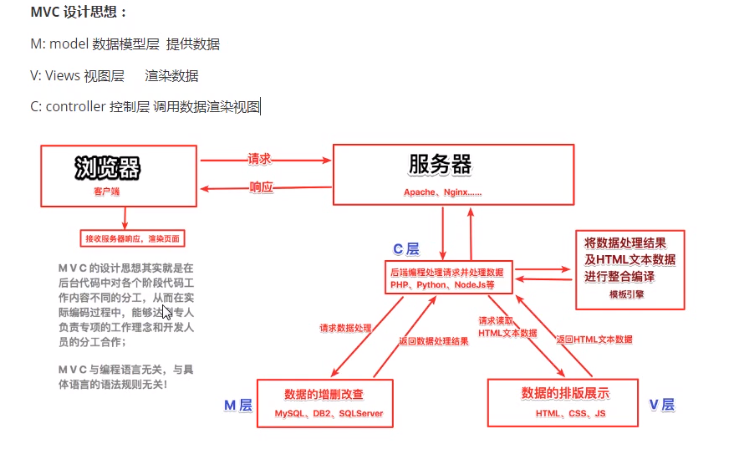

# 1 Vue 基础

概念：Vue 被设计为可以自底向上逐层应用。Vue 的核心库只关注视图层，不仅易于上手，还便于与第三方库或既有项目整合。

组件系统：允许我们使用小型、独立和通常可复用的组件构建大型应用。在 Vue 里，一个组件本质上是一个拥有预定义选项的一个 Vue 实例

## 1.1 使用及语法

基本使用 ： script src属性引入vue.js

熟悉后，再使用 vue-cli 

### 1.1.1 Vue 选择器

```vue
var app = new Vue({
  el: '#app',
  data: {
    message: 'Hello Vue!'
  }
})
```

el  接选择器，类似 css 中的选择器， 但是 常用 #xxx， id 选择器

可以选择任何标签，但是 推荐 div，

范围只有在 选择器选中的标签中使用

### 1.1.2 插值

文本： {{}}

```html
<div id="app">
  {{ message }}
</div>
<!-- message 指 vue 对象中 对象、属性以及函数调用 -->
```

### 1.1.3 指令概念

指令 (Directives) 是带有 `v-` 前缀的特殊 attribute。

及 带有 “v-” 的 自定义属性

**内容绑定，时间绑定**

### 1.1.4 v-text:  文本

```html
<div  id = "app">
    <h2 v-text="msg">
    </h2>
    <h2>
        xxx{{msg}}
    </h2>
</div>
<script>
	new Vue ({
        el:"#app",
        data:{
            msg:""
        }
    })
</script>
```

### 1.1.5 v-html : 将文本渲染为 HTML,

```html
<div id = "app">
    <p v-html="msg">
    </p>
</div>
<script>
	new Vue ({
        el:"#app",
        data:{
            msg:"<a href = 'www.baidu.com' />" # 内容中如果 又 HTML机构，就会被渲染
        }
    })
</script>
```

### 1.1.6 v-show : 控制 标签的 显示与隐藏，操作的是 标签的样式

**显示切换 属性绑定**

```html
<div id = "app">
	<h2 v-show = "showMsg">
        {{ msg }}
    </h2>
</div>
<script>
	new Vue ({
        el:"#app",
        data:{ 
            msg : "",
            showMsg : true
        }
    })
</script>
```

### 1.1.7 v-if : 控制标签的 创建 与 删除，操作的是 标签

```html
<div id = "app">
	<h2 v-if = "showMsg">
        {{ msg }}
    </h2>
</div>
<script>
    // 此时 h2 标签是被删除了
	new Vue ({
        el:"#app",
        data:{ 
            msg : "",
            showMsg : false
        }
    })
</script>
```

### 1.1.8 v-else

与 v-if 配套使用

### 1.1.9 v-else-if

与 v-if 配套使用

### 1.1.10 v-for 

 用于生成列表， 可用于 数组 列表 对象 数字 字符串 迭代器 等， 常用于 li 标签，但是 也可以使用其他标签，但是 会生成多个 

```html
<div id = "app">
	<ul>
        <!-- 生成 arr 长度个数的 li 标签 -->
        <li v-for = " item in arr">{{ item }}</li>
    </ul>
    <ul>
        <!-- item 为每次遍历 的数据，index 为 索引 -->
        <li v-for = " (item, index) in arr">{{ item }}</li>
    </ul>
</div>
<script>
	new Vue ({
        el:"#app",
        data:{ 
            arr : [1,2,3,4]
        }
    })
</script>
```

### 1.1.11  v-on :  简写 @ 绑定点击事件

```html
<div id = "app">
    <!-- 单击 -->
    <input type = "button" value = "按钮" v-on:click = "" />
    <!-- 鼠标 -->
    <input type = "button" value = "按钮" v-on:monseenter = "" />
    <!-- 双击 -->
    <input type = "button" value = "按钮" v-on:dbclick = "" />
    <input type = "button" value = "按钮" @dbclick = "" />
</div>
<script>
	new Vue ({
        el:"#app",
        data:{},
        methods : {
            do1 : function () {
                
            },
            do2 : function () {
                
            },
            do3 : function () {
                
            }
        }
    })
</script>
```

v- on扩展 :  自定义参数 事件修饰符

```html
<div id = "app">
    <!-- 单击 -->
    <input type = "button" value = "按钮" @click = "do1" />
    <!-- 回车键 事件， @keyup 会对所有的 键位 响应 -->
    <input type = "button" value = "按钮" @keyup.enter = "do2(param)" />
    <!-- 双击 -->
    <input type = "button" value = "按钮" v-on:dbclick = "" />
    <input type = "button" value = "按钮" @dbclick = "" />
</div>
<script>
	new Vue ({
        el:"#app",
        data:{},
        methods : {
            do1 : function () {
                
            },
            do2 : function (param) {
                
            },
            do3 : function () {
                
            }
        }
    })
</script>
```

### 

### 1.1.12 v-bind :  简写 :     操作 标签的一个属性 

```html
<style>
		.active {
			border : 1px solid red;
			}
			.active2 {
			border : 1px ;
			}
</style>
<div id = "app">
    <!-- 通过修改 msg 属性 ，改变 a 标签 跳转的 路径 -->
	<a v-bind:href = "msg">
        {{ msg }}
    </a>
    <!-- 注意：如果绑定属性为class时，不能直接绑定data中属性，故而只能控制class的 有无 -->
     <p :class = "call">不能识别</p>
    <p :class = "showCla?active:''">三元</p>
    <p :class = "{active:showCla}">对象</p>
</div>
<script>
	new Vue ({
        el:"#app",
        data:{ 
            msg : "www.baidu.com",
            showCla: true
        }
    })
</script>
```


### 1.1.13 v-model 

单项绑定：及 只有 在vue 中data 数据改变， `：value`绑定页面数据对应的数据改变，反过来没法

可以将表单中的数据 与 model 中的值 进行关联，双向绑定

```html
<div id = "app">
    <!-- 单击，v-model 不需要绑定 value -->
    <input type = "text" v-model = "msg" />

</div>
<script>
	new Vue ({
        el:"#app",
        data:{
            msg : ''
        }
    })
```

### 1.1.14 v-slot 缩写 #

提供具名插槽或需要接收 prop 的插槽。

### 1.1.15 v-pre

跳过这个元素和它的子元素的编译过程。可以用来显示原始 Mustache 标签。跳过大量没有指令的节点会加快编译。

```html
<span v-pre>{{ this will not be compiled }}</span>
```

### 1.1.16 v-cloak

即 在 vue 执行代码中，渲染到该标签时，就会被删除该属性。用于 数据未加载时 标签的隐藏

```html
<style>
    [v-cloak]{
		
    }
</style>
<div id='app' >
    <div v-cloak>
        {{obj.name}}
    </div>
</div>
<srcipt>
	var app = new Vue({
    	el:'#app',
    	data : {
    		obj:{name:"lz"}
    	}
    })
    
</srcipt>
```


### 1.1.17 v-once

只渲染元素和组件**一次**。随后的重新渲染，元素/组件及其所有的子节点将被视为静态内容并跳过。这可以用于优化更新性能。

数据的单次绑定

```html
<!-- 单个元素 -->
<span v-once>This will never change: {{msg}}</span>
<!-- 有子元素 -->
<div v-once>
  <h1>comment</h1>
  <p>{{msg}}</p>
</div>
<!-- 组件 -->
<my-component v-once :comment="msg"></my-component>
<!-- `v-for` 指令-->
<ul>
  <li v-for="i in list" v-once>{{i}}</li>
</ul>
```

## 1.2 MVVM设计思想

MVC ： 模型 视图 控制器（模板引擎）



MVVM：模型 视图  视图模型


## 1.3 扩展属性

### 1.3.1 计算属性

函数的调用，复用

```html
<div id='app' >
    <div v-cloak>
        {{obj.name}}
    </div>
</div>
<srcipt>
	var app = new Vue({
    	el:'#app',
    	data : {
    		obj:{name:"lz"}
    	},
	    // 调用 {{fun()}}一次,代码执行一次
	    methods:{
    		fun:fuction(){}
	    },
	    // 调用属性时，只要属性不变，后面调用都不会执行，之前结果缓存
  	    // 调用 {{funcomp}}多次,代码执行一次
    	computed:{
    		funcomp:functon(){}
    	}
    })
    
</srcipt>
```


### 1.3.2 侦听器

```html
<div id='app' >
    <div v-cloak>
        {{obj.name}}
    </div>
</div>
<srcipt>
	var app = new Vue({
    	el:'#app',
    	data : {
    		obj:{name:"lz"}
    	},
    	watch: {
    		// 监听属性的变化
    		obj:function(newObj, oldObj){
    			
 		   }
    	}
    })
    
</srcipt>
```

## 1.4 ref 操作DOM 

特殊情况 操作DOM

对需要操作的DOM节点标签添加ref属性

```html
<div id='app' >
    <div ref='refName'>
        {{obj.name}}
    </div>
</div>
<srcipt>
    // 在 管理的节点里面标签有了 ref 属性，那么
    // 在 vue 对象属性中就有了 $refs
	var app = new Vue({
    	el:'#app',
    	data : {
    		obj:{name:"lz"}
    	},
    	methods: {
    		fun:function(){
    			// 获取所有 ref属性中为refName的节点对象
				var dom = this.$refs.refName
 		   }
    	}
    })
    
</srcipt>
```

## 1.5 过滤器

### 1.5.1 局部（私有）过滤器

```html
<div id='app' >
    <div >
        <input type='text' v-model="obj.name"/>
        <!-- 使用过滤器 -->
        {{obj.name|filter1|filter2}}
    </div>
</div>
<srcipt>
    // 在 管理的节点里面标签有了 ref 属性，那么
    // 在 vue 对象属性中就有了 $refs
	var app = new Vue({
    	el:'#app',
    	data : {
    		obj:{name:"lz"}
    	},
    	filters:{
    		// 声明过滤器
    		filter1:function(val){
    			return val操作;
    		},
    		filter2:function(val){
    			return val操作;
    		}
    	}
    })
    
</srcipt>
```


### 1.5.2 全家过滤器

Vue 对象通用的

```vue
Vue.filter("filter3", function(val){
	return val操作；
})
```

## 1.6 自定义指令

```html
<div id='app' >
    <div v-dircName='obj'>
        <input type='text' v-model="obj.name"/>
       
    </div>
</div>
<srcipt>
    // 全局自定义指令,声明dircName 不需要v-，使用需要
    Vue.directive('dircName',{
	    // el 指 使用该指令的 节点
    	inserted:function(el){
    		
    	}
    })
    // 局部自定义指令
	var app = new Vue({
    	el:'#app',
    	data : {
    		obj:{name:"lz"}
    	},
    	directives:{
    		dircName:{
                inserted:function(el, data){
					// data
                }		
    		}
	    }
    });
</srcipt>
```

不具有数据绑定，只有在渲染之前绑定数据后才能达到效果

## 1.7 vue动画

实现通过 css实现的


Vue 提供了 `transition` 的封装组件，在下列情形中，可以给任何元素和组件添加进入/离开过渡

- 条件渲染 (使用 `v-if`)
- 条件展示 (使用 `v-show`)
- 动态组件
- 组件根节点


使用的是 通过 `transition` 标签包含，加上 对应 指定的class，再通过上面四个情况的消失，vue就会替换 class 六个的值，达到动画的效果

> 在进入/离开的过渡中，会有 6 个 class 切换。
>
> 1. `v-enter`：定义进入过渡的开始状态。在元素被插入之前生效，在元素被插入之后的下一帧移除。
> 2. `v-enter-active`：定义进入过渡生效时的状态。在整个进入过渡的阶段中应用，在元素被插入之前生效，在过渡/动画完成之后移除。这个类可以被用来定义进入过渡的过程时间，延迟和曲线函数。
> 3. `v-enter-to`：**2.1.8 版及以上**定义进入过渡的结束状态。在元素被插入之后下一帧生效 (与此同时 `v-enter` 被移除)，在过渡/动画完成之后移除。
> 4. `v-leave`：定义离开过渡的开始状态。在离开过渡被触发时立刻生效，下一帧被移除。
> 5. `v-leave-active`：定义离开过渡生效时的状态。在整个离开过渡的阶段中应用，在离开过渡被触发时立刻生效，在过渡/动画完成之后移除。这个类可以被用来定义离开过渡的过程时间，延迟和曲线函数。
> 6. `v-leave-to`：**2.1.8 版及以上**定义离开过渡的结束状态。在离开过渡被触发之后下一帧生效 (与此同时 `v-leave` 被删除)，在过渡/动画完成之后移除。

我们需要就是 编写 六个类型对应的css

对于这些在过渡中切换的类名来说，如果你使用一个没有名字的 ``，则 `v-` 是这些类名的默认前缀。如果你使用了 ``，那么 `v-enter` 会替换为 `my-transition-enter`。

`v-enter-active` 和 `v-leave-active` 可以控制进入/离开过渡的不同的缓和曲线，在下面章节会有个示例说明。

```html
<style>
    .test-enter-active{
        
    }
</style>
<div id='app' >
    <div v-dircName='obj'>
        <transition name='test'>
	        <input type='text' v-model="obj.name"/>
       </transition>
    </div>
</div>
<srcipt>

</srcipt>
```

## 1.8 原型及面向对象

js中每一个对象都有原型，所有对象的原型 Object

原型链： 类似 继承

```js
// 创建构造函数
var f = function() {
    this.a = 1;
}
var fObj = new f();

// 第二个类型实例
var cObj = {
    fun(){
        
    }
}
// 类似于 继承了
cObj.__proto__ = fObj;

// 修改构造函数的 默认原型
f.prototype = cObj;
var ffObj = new f();

// 获取当前实例的构造函数，由于修改了原型，而不是 f()
ffObj.constructor
var f = function() {
    // 解决
    this.constructor = f;
    this.a = 1;
}
```

