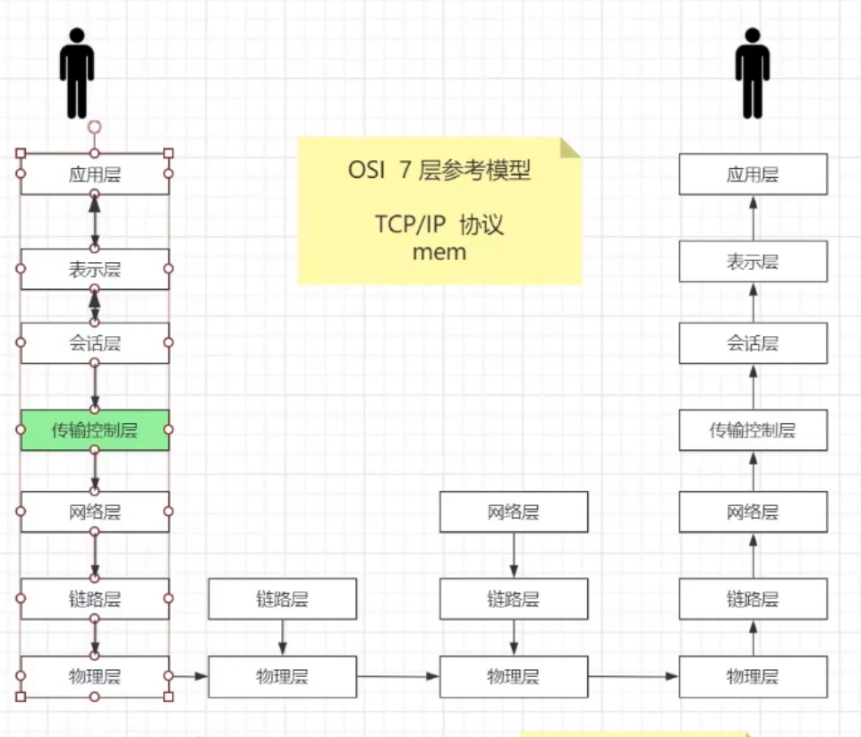
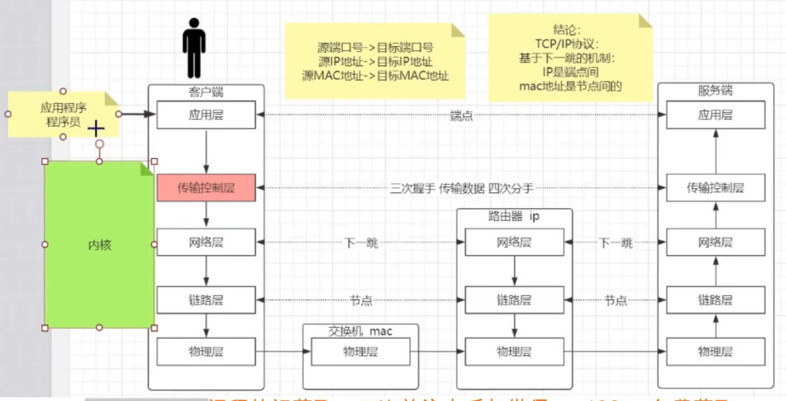

[[TOC]]

### OSI 7层参考模型

减去 表示层 会话层， 这主要是 https ，等加密进行的

应用层程序要准备某种协议的数据，在发送前，通过内核和服务器连接（即传输控制层）。

### 传送 控制 层

**TCP**：面向**连接**的  **可靠的**传输协议，

**三次握手**： SYN  SYN+ACK  ACK 后，内存中进行为对方开辟队列空间，socket， **程序只是拿到的是 内核中 三次握手后，开辟的队列中的数据**

TCP长连接：可以内核配置心跳，如果上层是 http  协议会关闭连接进行四次分手

**socket**：**套**接字 四元组：ip:port+ip:port 连接的唯一性，所以才能多个页面访问服务端，返回的数据不同 

**关闭连接的四次分手**：
