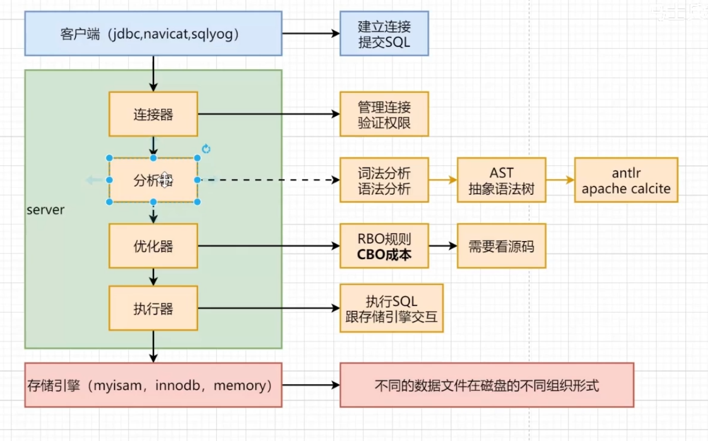
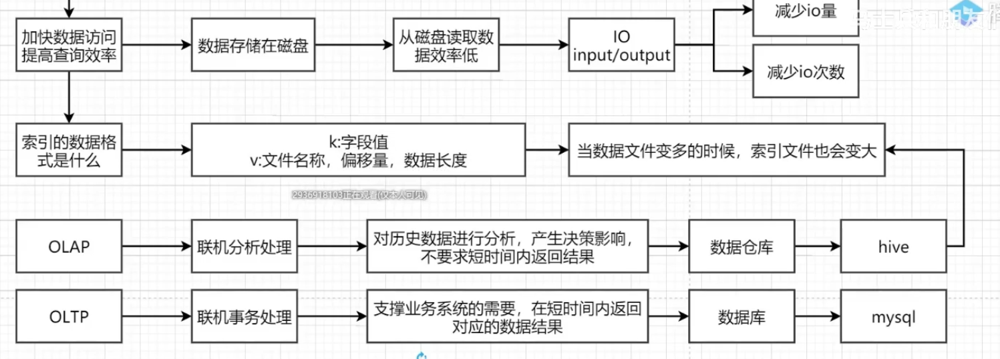
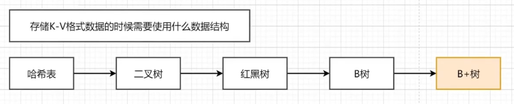
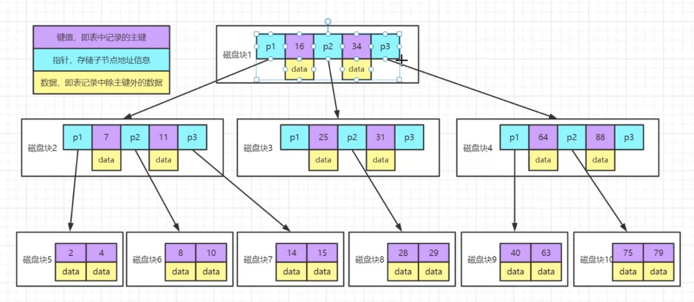
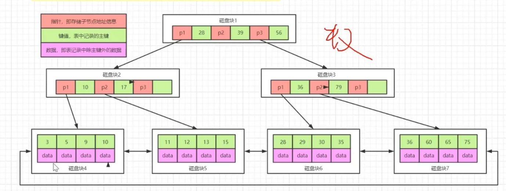
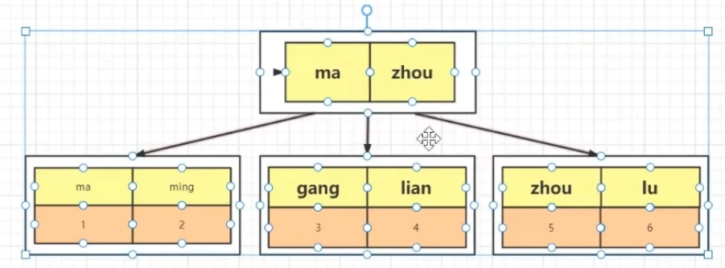
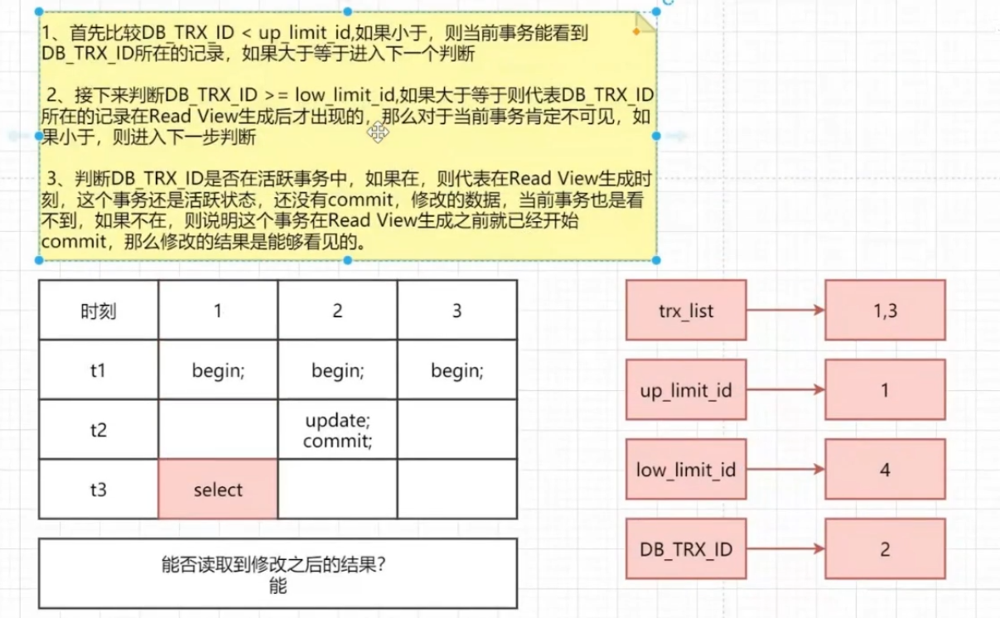
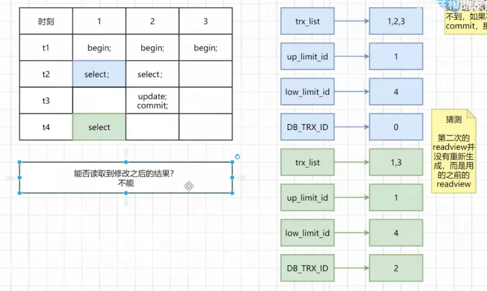
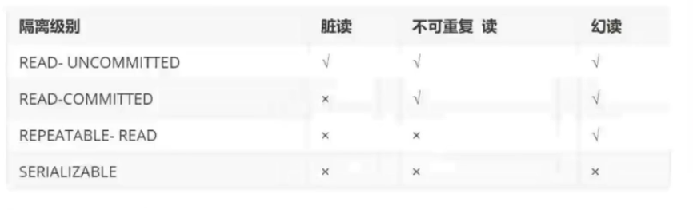

MySQL 为什么采用 B+树作为索引？

https://juejin.cn/post/7081065180301361183?utm_source=gold_browser_extension

### 1  MySQL 逻辑结构

### 2 MySQL 索引系统如何设计？ 为啥用B+树？

众多的数据结构在逻辑层面可分为：**线性结构** 和 **非线性结构**。

线性结构有：**数组**、**链表**，基于它们衍生出的有**哈希表**（哈希表也称散列表）、**栈**、**队列**等。

非线性结构有：**树**、**图**。

还有其他数据结构如：**跳表**、**位图** 也都由基础数据结构演化而来，不同的数据结构存在即都是为了解决某些场景问题。

> 由于数据要持久化，即保存到磁盘，性能瓶颈是 IO。
> 
> 1. 尽量减少 IO 操作
> 2. 尽快安装区间高效地范围查找
> 
> 所以有满足以这两条主要条件的除了**树结构**你还会想到其他什么数据结构？
> 
> 哈希表、跳表

随着数据量的增加，不可能把全部索引读取到内存中。 分块读取（分而治之）

#### 哈希表

1. 为了让数据尽可能散列，因此要使用哈希表需要选择合适的哈希算法，避免哈希碰撞和哈希冲突
2. 数据存储无序的，范围查询效率低下
3. innodb 存储引擎支持 自适应 hash

#### 二叉树 BST AVL 红黑树

最多只能两个分支 （IO次数相对多，由于磁盘预读的限制，所以一次读取，最好就是能多个值，来尽量填充一个 **页** ）

后三个：有序

后两个：平衡

磁盘预读：内存和磁盘交互的时候，有个基本的逻辑单位，页或者datapage，一般是 4K 或者 8K，读取数据的时候，一般都是操作页的整数倍。

所以为了减少IO，即减少树的高度，与增加一次读取的页的大小，演化成了 多叉树 即 B树

#### B树

一棵 *m* 阶 B 树 (B-Tree) 是满足如下性质的多叉查找树： 
 (1) 每个内部节点至多有 *m* 个子节点； 
 (2) 每个内部节点至少有 *m/2* 个子节点 (根除外)； 因为 节点分裂一般都是这样 （M + 1) /2
 (3) 如根节点为内部节点，其至少有 *2* 个子节点； 
 (4) 具有 *K* 个子节点的内部节点有 *K-1* 个键； 
 (5) 所有外部节点的层级均相同，且不携带信息。聚簇索引，耳机索引 和联合索引 具备那些特点

每个节点：键值（表中记录的主键）  指针（存储子节点的地址信息）  数据（记录除主键外的数据）

问题：

1. 每个节点都存储了数据，导致一次读取页，包含了索引以外的值，从而减少整个树，在固定页大小时，一次查询的 索引数据，变相增加了高度
2. 无法高效区间查询

#### B+树

1. 将所有的节点中 数据，放到叶子节点中

一般情况下，三至四层的B+树，支持了 千万级别的数据。

> 计算： p1 指针固定，28 云云 索引。 所以如果一个索引太大，就会导致 整个树 固定层级时，容纳数据变小
> 
> 索引自增：在满足业务情况下，尽量满足索引自增。如果，不自增，可能会导致节点的分裂

### 3 聚簇索引、二级索引、联合索引

> 聚簇索引
> 
> ​    innodb存储引擎中，数据在进行插入的时候，数据必须跟某一个索引列绑定在一起，如果表中有主键，那么跟主键绑定，没有主键与唯一键绑定，没有唯一键，和一个6字节的 rowid 绑定。
> 
> ​    数据和索引放在一起的叫聚簇索引，反之为非聚簇索引。
> 
> ​    innodb还支持非聚簇索引。

非聚簇索引叶子指向 聚簇索引 key

> 二级索引 辅助索引
> 
> ​    一个表可以有多个索引
> 
> ​    而且每个索引也就有一个B+树
> 
> ​    只存储一份数据，其他非聚簇索引的叶子节点中存储的是聚簇索引的key 值。

> 联合索引
> 
> ​    类似联合主键，一般情况下设置索引列的时候，只会选择一个列作为索引字段。但是某些特殊情况下，需要将多个列组成一个索引字段

### 4 进行索引优化注意什么

1. 索引字段大小，
2. 满足业务需要的情况下，尽可能自增
3. 索引字段尽可能不要为 null
4. 选择索引时，索引的基数尽可能大， DV(唯一值)/count >= 80%，例如性别 不适合，即不重复的值尽量多
5. 不要给所有字段都加索引，不是越多越好。会占用太多存储空间
6. 索引字段尽量不要修改
7. 避免索引失效

### 5 什么情况下索引失效

1. 左like
2. 索引字段不要添加任何表达式操作
3. 索引字段在使用的时候，不要出现类型的隐式转换
4. 不要出现函数计算
5. 组合索引在使用的时候要 最左匹配原则
6. in 或者 or 在很多情况会导致失效，但是还得看具体情况
7. 在使用组合索引时，如果中间某个索引使用了范围查询，就会导致失效

#### 回表

通过 二级索引 查询到的 叶子节点中，主键的值，再去进行 主键 查询 B+树，效率比较低

#### 索引覆盖

通过 二级索引 查询到的 叶子节点中， 包含了 需要获取的数据，不需要去 ID B+树中查询全部数据

#### 最左匹配原则

针对组合索引

在查询的时候，必须从左匹配 （优化器会优化）

#### 索引下推

没有索引下推：通过条件一拿到符合的数据，然后在 server中进行 条件二 过滤

索引下推：直接更具 条件一 条件二 在存储引擎中筛选对应的数据

#### 索引优化

数据量非常大的表，一个简单的SQL，一个条件，也走了索引，只需要几个字段，但是慢。使用 联合索引 ，避免回表 走的 索引覆盖

### 6 事务的四个特点  实现的原理

**ACID**

1. 原子性

2. 一致性

3. 隔离性

4. 持久性

binlog（二进制日志，默认不开启，数据同步与恢复） MySQL server

undolog（回滚日志） redolog（前滚日志） innodb

errorlog（执行过程中的错误） slowlog（慢日志） relaylog（中继日志主从同步）

#### 1 实现 原子性

**undolog：** 包含之前版本的标识，进行回滚到前一版本

#### 2 实现 一致性

一致性是其他三个特点共同保证的

#### 3 实现 隔离性

锁

MVCC 多版本并发控制

#### 4 实现 持久性

**redolog：** 固定空间的循环写

磁盘读取到内存中的数据被修改后，生成的redolog，顺序IO 追加，类似流水账，

 数据持久化到磁盘是 随机IO。

binlog  和 redolog 都会同时写数据，那么 谁先？

无论谁先提交，都不好，而是使用二阶段提交

### 7 MySQL 的redolog  undolog binlog

#### 7.1 原子性 持久性 redo log

重做日志， 

一部分是内存中日志缓冲  redo log buffer

另外是存放磁盘的重做日志文件 redo log file 持久化的

#### 7.2 一致性 undo log

### 8  什么是二阶段提交  如何保证宕机时的数据一致性

获取数据-->数据是否在内存中-->从磁盘读取-->返回数据-->更改数据-->写入新数据-->新数据更新到内存-->写入 redolog 处于 prepare 阶段-->写binlog --> 提交事务 prepare状态  修改为 commit 阶段

###cx_Freeze 9 MVCC如何实现多版本并发控制  解决读写冲突

**多版本并发控制**

并发情况： 读读（无） 读写（有数据安全问题： 脏读 幻读 不可重复读） 写写（数据可能丢失）

锁的方式 效率低，还可以类似Java CAS， MVCC 类似

**当前读**：数据读取的时候，都是最新的版本数据 触发： select lock in share, select for update, update delete insert

**快照读**：读取历史版本数据  触发 所有 的select

当两个事务开启时：A事务先查询了一次，此时B事务修改，提交后，A事务再查询，还是第一查询得到的数据 （MVCC）

#### MVCC 操作

隐藏字段：

1. DB_TRX_ID 创建这条记录或者最后修改这条记录的事务ID， 在事务操作的时候，事务ID的值是递增的

2. BD_ROLL_PTR 回滚指针，指向数据的上个版本，undolog 中的上个版本

3. DB_ROW_ID  隐藏主键，如果没有显示主键的话，会多一个隐藏主键

undolog：数据的历史版本， BD_ROLL_PTR 为链点的链表，头为最新，尾为最旧数据， 后台有个purge线程 会清除没用的数据。

readview：事务进行快照读操作的时候，产生的读视图

1. trx_list：readview生成适合当前系统中活跃的事务ID

2. up_limit_id 活跃列表中最小的事务ID

3. low_limit_id 系统尚未分配的下个事务ID

生成的 readview 会根据可见性算法，判断是否可以读取对应的数据结果

在  RR 隔离级别中： 每次快照读，都会生成新的 readview

RC 级别中：只会在第一快照读时，生成readview

### 10  MySQL 中的 幻读 ，如何解决

幻读只能加锁才能解决，或者 序列化读

产生幻读的原因：

事务操作中，都是快照读时，不会产生， 如果 快照读 和 及时读，一起使用就会产生幻读。