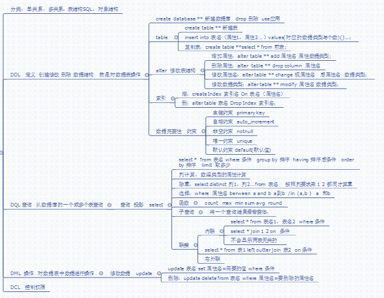

# MySQL初级 #
关系性数据库,以表的形式存放数据.
## 数据库 ##
-	DDL(定义) 创建 修改 删除 数据结构
-	DQL(查询) 从数据库中一个或多个表查询指定
-	DML(操作) 即对数据的 增 删 改
-	DCL(操控) 权限
## DDL ##
```sql
# 查看数据库
show databases;
创建数据库
create database 数据库名;
切换数据库
use 数据库名;
删除数据库
drop  数据库名;
```
**管理表**
	
	创建表
	create table 表名(列1,列2,...);
	创建临时表
	create table #表名(...);
	
	添加数据
	insert into 表名 (列1,列3,...)
	values(行1,行3...),(),...;//value 只添加一个,若多个,最后括号不加','
	insert into 表名 values ();
	
	复制表(备份)
	create table 新表名 select * from 源表;
	//只复制数据结构,后加where 1=0;
	insert into 表名 select * from 源表;
	
	修改表结构
	alter table 表名 add 属性名(列名) 数据类型;
	alter table 表名 drop column 属性名;
	alter table 表名 change 属性名 新名 数据类型;
**索引**

	create Index 索引名 on 表名(属性名);//添加
	//优化对与该表该属性名的查询速度
	alter table 表名 drop index 索引名;//删除
## 数据完整性 ##
在定义时,常用于约束表格,进行深度要求.(但一般数据库,应该只做数据的增删查改)

	主键约束(数据额唯一性)
	凡是有业务性的列,都不建议为主键
	
	id int primary key  ()AUTO_INCREMENT(自增) 
	其他的
	notnull 非空
	unique 唯一 null 和null不等
## DML ##
	修改
	update 表名 set 属性名 = 值 where 条件
	删除 
	delete from 表名 where 条件;
	
	DELETE FROM table1 //删除表,有记录
	drop TABLE table1	//直接就把表删了
### 设计数据库的范式三约定 ###
1.	原子性:每列不能在分.提高复用性
2.	行不能再分
3.	列中 的数据要与主键有关.
## DQL(查询) ##
	select * from 表名 where 条件 (and or );
	
	select * from 表名 limit n1, n2;//从n1开始 n2个数据
	
	select * from 表名 order by 属性1,属性2...默认asc   降序desc

#### 函数 ####
	select count(属性名) from 表名;//求总数
	max() //最大 min
	avg() //平均值
	sum //求和

**where(条件) -> group by(分组) -> having() -> order by(排序) ->limit(选择)**

distinct  去重
#### 子查询 ####
将查询的语句作条件或其他内容使用,作为条件的查询语句运算优先.

	select 1 from 2 where 3;
1.	相关子查询 与3有关系
2.	子查询返回多行多列时,作为中间表
3.	非相关查询,只用一次,
## 联结 ##
将多个表联结起来.
#### 自联 ####
	select * from 表1,表2 where 条件;
	若不写条件,即交叉联
#### 内联 ####
inner join on ..
	
	select * from 表1 inner(可不写) join 表2 on 表1.列=表2.列;
两个相等时联结,无值则不联,为空则内联不显示.
#### 外联 ####
**左外联**

	select * from left outer(可不写) join 表2 on  表1.列=表2.列;
**右外联**

	select * from right outer(可不写) join 表2 on  表1.列=表2.列;
声明外联,而那边的表的所有数据都会显示.
## 汇总图 ##
