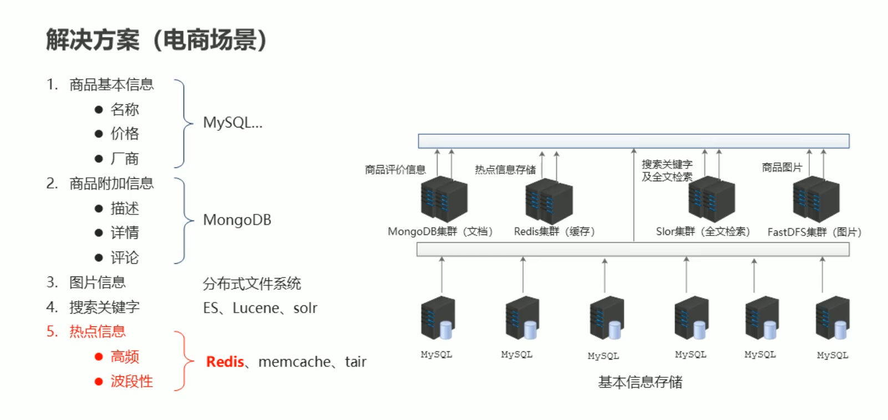

# 自动生成目录

<ul>
    <li v-for = " (item, index) in theme[sidebar][root_path]">
        <a :href=item.link>{{item.text}}</a>
        <ol>
            <li v-if=filter(item.items) v-for = "(item2, index) in item.items">
                <a :href=item2.path>{{item2.text}}</a>
            </li>
        </ol>
    </li>
</ul>

