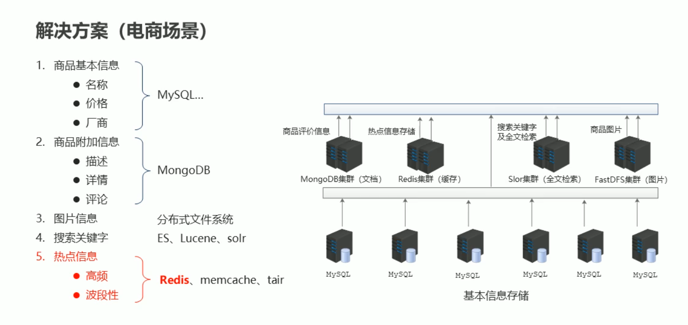

## 关系型数据库
## SQL 基础
[[SQL初级]](SQL初级.md)
[[SQL进阶]](SQL进阶.md)
[[数据库事务]](数据库事务.md)
[[非常用Sql]](非常用Sql.md)

### MySQL
[MySql 服务语句](MySQL/MySql%20服务语句.md)
[MySQL 事务问题](MySQL/MySQL%20事务问题.md)
[MySql 压缩包安装](MySQL/MySql%20压缩包安装.md)
[MySQL 主从复制 以及 amoeba代理](MySQL/MySQL主从复制以及Amoeba代理.md)
[MySQL Dockers安装 及 主从复制](MySQL/MySQL%20Dockers安装及主从复制.md)
[014 MySQL](MySQL/014%20MySQL.md)

### Postgresql
[PostgreSQL安装与初始化](PostgreSQL/PostgreSQL安装与初始化.md)

## 非关系型
### Redis
[01 Reids 简介](Redis/01%20Reids简介.md)
[02 Reids 数据类型](Redis/02%20Reids数据类型.md)
[03 Redis string操作](Redis/03%20RedisString操作.md)
[04 Redis hash操作](Redis/04%20RedisHash操作.md)
[015 Redis](Redis/015%20Redis.md)

### MongoDB
[018 Mongodb](018%20Mongodb.md)