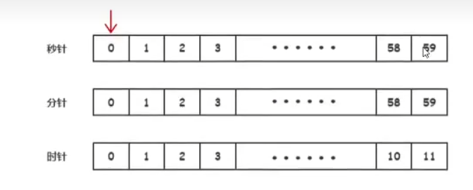
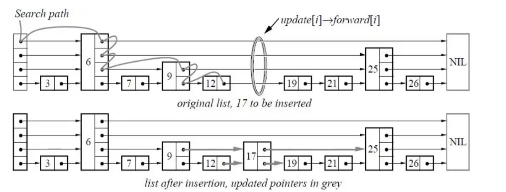

https://juejin.cn/post/7093153370046726152

B 树详解与实现

https://my.oschina.net/xcafe/blog/5433074

从 2-3-4 树到红黑树

https://my.oschina.net/xcafe/blog/5452563

### 二叉树

从左到右依次递增

### 自平衡二叉树 AVL

节点的两个子节点层数差不能大于 1

### 红黑树

### B 树

键值都在每个节点上，节点上可以多个，具体个数由 多少阶定义， **(4, 7)** 7 阶

优点：

1.比二叉树更加宽，查询的 IO 更少，

2.可以范围查找

缺点：也是范围，不能跨节点范围查询

### B+树

类似 B 树，但是 各个节点只有 末级才有键值，并且相互链式，上层节点 为引用，类似跳表

### 时间轮

当分针走向下一点时，会将 下一个分钟内的任务 映射到 秒针 任务上，时针同理。

1. 指针数组

2. 存储海量定时任务

3. 多线程的定时设计

红黑树、最小堆、跳表 有序的结构实现定时器： 找到最小值 触发时间进行组织

时间轮：执行顺序进行组织

任务的添加后，并不是 触发顺序有序的，而是 按照时间 时分秒，点位来进行存储触发的。

### 跳表

redis zset，leveldb ，rocksdb

有序数组 可以二分查 logn

有序链表 n ， 使用跳表 进行 logn，

随机性的数据结构，样本个数，

查询从最上层开始，而不是 从左到右开始
